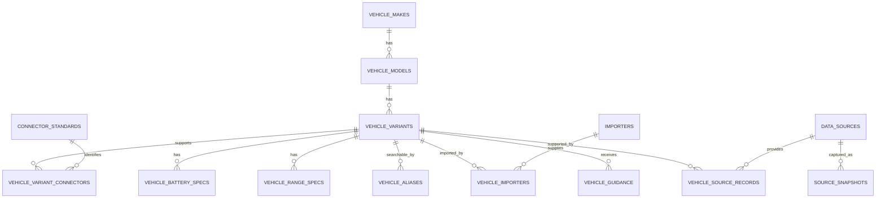

# ساختار پیشنهادی دیتابیس خودروهای برقی

## هدف

این ساختار برای پلتفرمی طراحی شده که کاربر ابتدا خودروی خود را انتخاب می‌کند و سپس سامانه بر اساس نسخهٔ دقیق خودرو، اطلاعات و راهنمایی‌های زیر را ارائه می‌دهد:

- نمایش شارژرهای سازگار با خودرو
- تشخیص سازگاری مستقیم یا نیاز به تبدیل
- تخمین زمان شارژ
- نمایش محدودیت توان AC و DC خودرو
- ارائهٔ راهنمای شارژ و نگهداری باتری
- نمایش هشدارهای مرتبط با نسخه، واردکننده یا بازار مبدأ
- نگهداری تاریخچه و منبع هر مشخصه

دادهٔ eMapna باید منبع اصلی یا `primary source` باشد، اما نباید پاسخ API مستقیماً به جدول خودرو تبدیل شود. پاسخ خام باید ابتدا ذخیره شود و سپس وارد ساختار نرمال‌شدهٔ زیر شود.

## اصول طراحی

1. برند، مدل و نسخهٔ دقیق خودرو موجودیت‌های جدا هستند.
2. سال تولید به‌تنهایی نسخهٔ خودرو را مشخص نمی‌کند. بازار مبدأ، واردکننده و تیپ نیز مهم‌اند.
3. یک خودرو می‌تواند چند ورودی شارژ داشته باشد. کانکتورها باید رابطهٔ چندبه‌چند داشته باشند.
4. کانکتور AC و DC نباید در یک مقدار عمومی مانند `GB/T` ادغام شوند.
5. دادهٔ خام منبع همیشه بدون تغییر نگهداری شود.
6. اصلاح نام‌ها در لایهٔ نرمال‌شده انجام شود و مقدار اصلی منبع از بین نرود.
7. هر مشخصه باید منبع، زمان دریافت و سطح اطمینان داشته باشد.
8. انتخاب کاربر باید به `vehicle_variant_id` متصل شود، نه فقط نام مدل.

## رابطهٔ موجودیت‌ها



## جداول اصلی

### ۱. `vehicle_makes`

برند استاندارد خودرو را نگهداری می‌کند.

| ستون | نوع پیشنهادی | توضیح |
|---|---|---|
| `id` | `uuid` | کلید اصلی داخلی |
| `slug` | `varchar(100)` | شناسهٔ یکتا مانند `volkswagen` |
| `name_en` | `varchar(150)` | نام انگلیسی استاندارد |
| `name_fa` | `varchar(150)` | نام فارسی استاندارد |
| `country_code` | `char(2)` | کشور برند در صورت نیاز |
| `is_active` | `boolean` | امکان نمایش در انتخاب‌گر |
| `created_at` | `timestamptz` | زمان ایجاد |
| `updated_at` | `timestamptz` | زمان آخرین تغییر |

قیدهای مهم:

- `slug` باید یکتا باشد.
- تفاوت حروف بزرگ و کوچک نباید برند جدید ایجاد کند.
- نام‌های `VOLVO`، `VOLVO ` و `Volvo` باید به یک رکورد متصل شوند.

### ۲. `vehicle_models`

خانوادهٔ مدل را مستقل از سال و تیپ نگهداری می‌کند.

| ستون | نوع پیشنهادی | توضیح |
|---|---|---|
| `id` | `uuid` | کلید اصلی |
| `make_id` | `uuid` | ارجاع به برند |
| `slug` | `varchar(150)` | مانند `id-4-crozz` |
| `name_en` | `varchar(200)` | نام استاندارد انگلیسی |
| `name_fa` | `varchar(200)` | نام فارسی |
| `vehicle_class` | `varchar(50)` | سدان، SUV، MPV و غیره |
| `is_active` | `boolean` | وضعیت نمایش |
| `created_at` | `timestamptz` | زمان ایجاد |
| `updated_at` | `timestamptz` | زمان تغییر |

قید یکتا:

```sql
UNIQUE (make_id, slug)
```

### ۳. `vehicle_variants`

مهم‌ترین جدول سامانه است. انتخاب نهایی کاربر باید به یکی از رکوردهای این جدول برسد.

| ستون | نوع پیشنهادی | توضیح |
|---|---|---|
| `id` | `uuid` | شناسهٔ داخلی پایدار |
| `model_id` | `uuid` | ارجاع به مدل |
| `variant_name` | `varchar(200)` | تیپ؛ مانند `Pure Plus` یا `EQB260` |
| `model_year_from` | `smallint` | اولین سال معتبر |
| `model_year_to` | `smallint` | آخرین سال معتبر؛ در صورت ادامه تولید `null` |
| `powertrain_type` | `varchar(20)` | `BEV`، `PHEV`، `EREV` یا `HEV` |
| `origin_market` | `varchar(50)` | مانند `CN`، `EU` یا `IR` |
| `drive_type` | `varchar(20)` | `FWD`، `RWD` یا `AWD` |
| `motor_power_kw` | `numeric(7,2)` | توان موتور یا مجموع موتورها |
| `operating_voltage_v` | `numeric(7,2)` | ولتاژ نامی سامانه |
| `ac_charge_limit_kw` | `numeric(7,2)` | حداکثر توان ورودی AC خودرو |
| `dc_charge_limit_kw` | `numeric(7,2)` | حداکثر توان ورودی DC خودرو |
| `source_priority` | `integer` | مقدار `priority` منبع، در صورت کاربرد |
| `verification_status` | `varchar(20)` | `verified`، `source_only`، `needs_review` یا `rejected` |
| `is_selectable` | `boolean` | آیا کاربر می‌تواند آن را انتخاب کند؟ |
| `created_at` | `timestamptz` | زمان ایجاد |
| `updated_at` | `timestamptz` | زمان تغییر |

قید پیشنهادی:

```sql
CHECK (model_year_from BETWEEN 1990 AND 2100)
CHECK (model_year_to IS NULL OR model_year_to >= model_year_from)
CHECK (powertrain_type IN ('BEV', 'PHEV', 'EREV', 'HEV'))
CHECK (verification_status IN ('verified', 'source_only', 'needs_review', 'rejected'))
```

در صورتی که eMapna تیپ و سال دقیق را ارائه نمی‌کند، یک نسخهٔ عمومی با `variant_name = 'Default'` بسازید و آن را `source_only` نگه دارید. بعداً نسخه‌های سال/تیپ دقیق می‌توانند زیر همان مدل اضافه شوند.

### ۴. `connector_standards`

فرهنگ استانداردهای فیزیکی شارژ است.

| ستون | نوع پیشنهادی | نمونه |
|---|---|---|
| `id` | `smallserial` | کلید اصلی |
| `code` | `varchar(40)` | `AC_GBT` |
| `display_name` | `varchar(100)` | `GB/T AC` |
| `current_type` | `varchar(5)` | `AC` یا `DC` |
| `emapna_name` | `varchar(100)` | `Car-AC-GB/T` |
| `is_active` | `boolean` | وضعیت استفاده |

مقادیر اولیه:

| `code` | `display_name` | `current_type` | `emapna_name` |
|---|---|---|---|
| `AC_GBT` | GB/T AC | AC | Car-AC-GB/T |
| `AC_TYPE1` | Type 1 | AC | Car-AC-Type1 |
| `AC_TYPE2` | Type 2 | AC | Car-AC-Type2 |
| `DC_GBT` | GB/T DC | DC | Car-DC-GB/T |
| `DC_CCS2` | CCS2 | DC | Car-DC-CCS2 |
| `DC_CHADEMO` | CHAdeMO | DC | Car-DC-CHAdeMO |

مقدار `-` در API کانکتور نیست. این مقدار باید به‌صورت `no_dc_declared = true` روی رابطه یا نسخه ذخیره شود.

### ۵. `vehicle_variant_connectors`

رابط چندبه‌چند میان نسخهٔ خودرو و کانکتور است.

| ستون | نوع پیشنهادی | توضیح |
|---|---|---|
| `vehicle_variant_id` | `uuid` | نسخهٔ خودرو |
| `connector_standard_id` | `smallint` | استاندارد کانکتور |
| `max_power_kw` | `numeric(7,2)` | محدودیت این ورودی، در صورت وجود |
| `port_position` | `varchar(50)` | محل پورت، در صورت نیاز |
| `is_primary` | `boolean` | کانکتور اصلی |
| `is_direct` | `boolean` | اتصال مستقیم بدون تبدیل |
| `verification_status` | `varchar(20)` | وضعیت اعتبار |
| `source_record_id` | `uuid` | منشأ این مشخصه |
| `verified_at` | `timestamptz` | زمان آخرین تأیید |

کلید اصلی ترکیبی:

```sql
PRIMARY KEY (vehicle_variant_id, connector_standard_id)
```

### ۶. `vehicle_battery_specs`

مشخصات باتری باید جدا باشد، چون یک تیپ ممکن است چند ظرفیت باتری داشته باشد.

| ستون | نوع پیشنهادی | توضیح |
|---|---|---|
| `id` | `uuid` | کلید اصلی |
| `vehicle_variant_id` | `uuid` | نسخهٔ خودرو |
| `capacity_gross_kwh` | `numeric(7,2)` | ظرفیت ناخالص |
| `capacity_usable_kwh` | `numeric(7,2)` | ظرفیت قابل استفاده |
| `capacity_min_kwh` | `numeric(7,2)` | حداقل، وقتی منبع چند ظرفیت مبهم دارد |
| `capacity_max_kwh` | `numeric(7,2)` | حداکثر |
| `chemistry` | `varchar(30)` | مانند `LFP` یا `NMC` |
| `source_value_raw` | `varchar(200)` | مقدار خام مانند `66 & 72 kwh` |
| `verification_status` | `varchar(20)` | وضعیت اعتبار |
| `source_record_id` | `uuid` | منبع |

اگر فقط یک عدد وجود دارد، آن را در `capacity_gross_kwh` ذخیره کنید. اگر منبع مشخص نکرده عدد ناخالص است یا قابل استفاده، مقدار را در `capacity_gross_kwh` قرار دهید ولی وضعیت را `source_only` نگه دارید.

### ۷. `vehicle_range_specs`

برد خودرو بدون استاندارد اندازه‌گیری معنای کافی ندارد.

| ستون | نوع پیشنهادی | توضیح |
|---|---|---|
| `id` | `uuid` | کلید اصلی |
| `vehicle_variant_id` | `uuid` | نسخهٔ خودرو |
| `range_km` | `numeric(7,2)` | برد اعلامی |
| `standard` | `varchar(20)` | `NEDC`، `CLTC`، `WLTP` یا `EPA` |
| `condition_label` | `varchar(100)` | در صورت وجود شرایط خاص |
| `source_value_raw` | `varchar(100)` | مقدار خام منبع |
| `source_record_id` | `uuid` | منبع |

نباید بردهای NEDC و WLTP در یک ستون بدون نگهداری استاندارد مقایسه شوند.

### ۸. `importers`

| ستون | نوع پیشنهادی | توضیح |
|---|---|---|
| `id` | `uuid` | کلید اصلی |
| `slug` | `varchar(120)` | شناسهٔ یکتا |
| `name_en` | `varchar(200)` | نام انگلیسی |
| `name_fa` | `varchar(200)` | نام فارسی |
| `is_active` | `boolean` | وضعیت فعالیت |

### ۹. `vehicle_importers`

یک مدل می‌تواند توسط چند واردکننده و با کانکتور متفاوت عرضه شود.

| ستون | نوع پیشنهادی | توضیح |
|---|---|---|
| `vehicle_variant_id` | `uuid` | نسخهٔ خودرو |
| `importer_id` | `uuid` | واردکننده |
| `valid_from` | `date` | شروع عرضه |
| `valid_to` | `date` | پایان عرضه |
| `notes` | `text` | توضیحات |
| `source_record_id` | `uuid` | منبع |

همین جدول دلیل مهمی است که نام واردکننده نباید یک متن ساده داخل جدول مدل باشد.

### ۱۰. `vehicle_aliases`

برای جست‌وجوی فارسی و انگلیسی ضروری است.

| ستون | نوع پیشنهادی | توضیح |
|---|---|---|
| `id` | `bigserial` | کلید اصلی |
| `vehicle_model_id` | `uuid` | مدل هدف |
| `vehicle_variant_id` | `uuid` | نسخهٔ هدف، در صورت اختصاصی بودن |
| `alias` | `varchar(250)` | عبارت جایگزین |
| `normalized_alias` | `varchar(250)` | نسخهٔ نرمال‌شده برای جست‌وجو |
| `language` | `varchar(10)` | `fa` یا `en` |
| `alias_type` | `varchar(30)` | `official`، `source`، `common` یا `typo` |

نمونه‌ها:

- `ID UNYX`
- `ID. UNYX`
- `ID Unyx`
- `آی دی یونیکس`
- `آیدی یونیکس`

قواعد نرمال‌سازی جست‌وجوی فارسی:

- تبدیل `ي` به `ی`
- تبدیل `ك` به `ک`
- حذف نیم‌فاصله و فاصله‌های تکراری برای کلید جست‌وجو
- یکسان‌سازی نقطه، خط تیره و فاصله در نام مدل
- تبدیل حروف انگلیسی به lowercase
- حفظ مقدار اصلی alias برای نمایش و ردیابی

### ۱۱. `data_sources`

| ستون | نوع پیشنهادی | توضیح |
|---|---|---|
| `id` | `uuid` | کلید اصلی |
| `code` | `varchar(50)` | مانند `emapna` |
| `name` | `varchar(150)` | نام منبع |
| `base_url` | `text` | آدرس منبع |
| `trust_rank` | `smallint` | اولویت منبع؛ عدد کمتر معتبرتر |
| `is_primary` | `boolean` | منبع اصلی بودن |

برای این پروژه:

```text
code = emapna
name = eMapna EV API
base_url = https://gen.emapna.com/api/evList/v2
is_primary = true
```

### ۱۲. `source_snapshots`

هر بار دریافت API یک snapshot مستقل ایجاد کند.

| ستون | نوع پیشنهادی | توضیح |
|---|---|---|
| `id` | `uuid` | شناسهٔ snapshot |
| `source_id` | `uuid` | منبع |
| `requested_at` | `timestamptz` | زمان درخواست |
| `http_status` | `smallint` | وضعیت HTTP |
| `request_body` | `jsonb` | مانند `{ "page": 0, "limit": 50 }` |
| `response_body` | `jsonb` | پاسخ کامل خام |
| `record_count` | `integer` | تعداد رکوردها |
| `content_hash` | `varchar(64)` | SHA-256 پاسخ برای تشخیص تغییر |
| `import_status` | `varchar(20)` | `pending`، `processed` یا `failed` |
| `error_message` | `text` | خطای پردازش |

نگهداری `response_body` باعث می‌شود هر تغییر یا اشتباه در نرمال‌سازی قابل بازسازی باشد.

### ۱۳. `vehicle_source_records`

رابط میان رکورد داخلی و رکورد API است.

| ستون | نوع پیشنهادی | توضیح |
|---|---|---|
| `id` | `uuid` | شناسهٔ داخلی |
| `source_id` | `uuid` | eMapna |
| `snapshot_id` | `uuid` | snapshot دریافت |
| `vehicle_variant_id` | `uuid` | نسخهٔ نرمال‌شده |
| `external_id` | `varchar(100)` | مقدار `_id` در eMapna |
| `raw_brand` | `varchar(250)` | برند خام |
| `raw_model` | `varchar(250)` | مدل خام |
| `raw_payload` | `jsonb` | همان شیء خودرو در پاسخ API |
| `first_seen_at` | `timestamptz` | اولین مشاهده |
| `last_seen_at` | `timestamptz` | آخرین مشاهده |
| `is_current` | `boolean` | آیا هنوز در آخرین snapshot وجود دارد؟ |
| `mapping_status` | `varchar(20)` | `mapped`، `needs_review` یا `ignored` |

قید مهم:

```sql
UNIQUE (source_id, external_id)
```

شناسهٔ `_id` مپنا باید فقط external ID باشد و نباید به‌عنوان کلید اصلی تمام دیتابیس استفاده شود.

## راهنمایی‌های خودرو

### ۱۴. `guidance_articles`

محتوای قابل استفاده برای راهنمایی کاربر را نگهداری می‌کند.

| ستون | نوع پیشنهادی | توضیح |
|---|---|---|
| `id` | `uuid` | کلید اصلی |
| `slug` | `varchar(180)` | شناسهٔ محتوا |
| `title_fa` | `varchar(300)` | عنوان فارسی |
| `body_markdown` | `text` | متن راهنما |
| `guidance_type` | `varchar(40)` | نوع راهنما |
| `severity` | `varchar(20)` | `info`، `warning` یا `critical` |
| `is_active` | `boolean` | وضعیت انتشار |
| `valid_from` | `timestamptz` | شروع اعتبار |
| `valid_to` | `timestamptz` | پایان اعتبار |

مقادیر پیشنهادی `guidance_type`:

- `charging_basics`
- `connector_warning`
- `adapter_warning`
- `battery_care`
- `dc_charge_limit`
- `cold_weather`
- `long_term_storage`
- `trip_planning`

### ۱۵. `vehicle_guidance`

راهنما را به خودرو، مدل یا نسخه متصل می‌کند.

| ستون | نوع پیشنهادی | توضیح |
|---|---|---|
| `id` | `uuid` | کلید اصلی |
| `guidance_article_id` | `uuid` | مقاله یا هشدار |
| `vehicle_variant_id` | `uuid` | نسخهٔ خاص؛ اختیاری |
| `vehicle_model_id` | `uuid` | مدل؛ اختیاری |
| `connector_standard_id` | `smallint` | استاندارد کانکتور؛ اختیاری |
| `powertrain_type` | `varchar(20)` | نوع قوای محرکه؛ اختیاری |
| `priority` | `smallint` | ترتیب نمایش |

حداقل یکی از محدوده‌های نسخه، مدل، کانکتور یا نوع قوای محرکه باید مقدار داشته باشد.

## انتخاب خودروی کاربر

### ۱۶. `user_vehicles`

| ستون | نوع پیشنهادی | توضیح |
|---|---|---|
| `id` | `uuid` | شناسهٔ خودروی کاربر |
| `user_id` | `uuid` | مالک رکورد |
| `vehicle_variant_id` | `uuid` | نسخهٔ انتخاب‌شده |
| `model_year` | `smallint` | سال خودروی واقعی کاربر |
| `importer_id` | `uuid` | واردکننده، در صورت اطلاع |
| `nickname` | `varchar(100)` | نام دلخواه کاربر |
| `vin_hash` | `varchar(128)` | هش VIN، نه VIN خام در حالت عادی |
| `connector_verified_by_user` | `boolean` | تأیید پورت توسط کاربر |
| `connector_photo_asset_id` | `uuid` | عکس پورت در صورت وجود |
| `created_at` | `timestamptz` | زمان ثبت |
| `updated_at` | `timestamptz` | زمان تغییر |

اگر نسخهٔ انتخاب‌شده `needs_review` باشد، از کاربر بخواهید واردکننده یا عکس درگاه شارژ را تأیید کند.

## سازگاری شارژر

خودرو با ایستگاه شارژ زمانی سازگاری مستقیم دارد که:

1. کانکتور فیزیکی ایستگاه با یکی از `vehicle_variant_connectors` یکسان باشد.
2. نوع جریان AC یا DC یکسان باشد.
3. وضعیت کانکتور خودرو `rejected` یا `needs_review` نباشد، مگر با نمایش هشدار.
4. محدودیت ولتاژ یا پروتکل خاصی وجود نداشته باشد.

توان شارژ قابل انتظار:

```text
effective_power_kw = MIN(
  charger_connector.max_power_kw,
  vehicle_variant_connector.max_power_kw,
  vehicle_variant.ac_charge_limit_kw یا dc_charge_limit_kw
)
```

زمان تقریبی شارژ:

```text
energy_needed_kwh = usable_battery_kwh × (target_soc - current_soc)
ideal_hours = energy_needed_kwh / effective_power_kw
estimated_hours = ideal_hours × loss_and_curve_factor
```

برای AC می‌توان ضریب اولیهٔ `1.10` تا `1.20` در نظر گرفت. برای DC محاسبه باید منحنی شارژ و کاهش توان بعد از حدود ۸۰ درصد را نیز در نظر بگیرد. این ضرایب باید در جدول تنظیمات نگهداری شوند، نه داخل کد ثابت.

### تبدیل‌ها

تبدیل کانکتور نباید با سازگاری مستقیم یکی تلقی شود. در صورت پشتیبانی از تبدیل، جدول جداگانه‌ای مانند زیر بسازید:

```sql
connector_adapters (
  id uuid primary key,
  from_connector_id smallint not null,
  to_connector_id smallint not null,
  supports_ac boolean not null,
  supports_dc boolean not null,
  max_power_kw numeric(7,2),
  safety_status varchar(20) not null,
  notes text
)
```

خروجی سازگاری باید یکی از این وضعیت‌ها باشد:

- `direct`
- `adapter_required`
- `not_compatible`
- `needs_verification`

## نگاشت فیلدهای eMapna

| فیلد API | مقصد پیشنهادی |
|---|---|
| `_id` | `vehicle_source_records.external_id` |
| `brand` | ابتدا alias، سپس `vehicle_makes` |
| `model` | ابتدا alias، سپس `vehicle_models` |
| `batterySpecs` | مقدار خام در source record و مقدار عددی در `vehicle_battery_specs` |
| `chargeLimit` | `vehicle_variants.ac_charge_limit_kw` یا `dc_charge_limit_kw` پس از تشخیص AC/DC |
| `priority` | `vehicle_variants.source_priority` |
| `connectors[]` | `vehicle_variant_connectors` |
| `evCarType` | `vehicle_variants.powertrain_type` |
| `importer` | `importers` و `vehicle_importers` |
| `operatingVoltage` | `vehicle_variants.operating_voltage_v` |
| `range` | `vehicle_range_specs.range_km` |
| `rangeStandard` | `vehicle_range_specs.standard` |
| کل شیء | `vehicle_source_records.raw_payload` |

## فرایند همگام‌سازی eMapna

ترتیب پیشنهادی هر sync:

1. درخواست بدون `connectorNames` ارسال شود تا همهٔ رکوردها دریافت شوند.
2. پاسخ کامل در `source_snapshots` ذخیره شود.
3. hash پاسخ با snapshot قبلی مقایسه شود.
4. رکوردها بر اساس `_id` upsert شوند.
5. نام برند و مدل با جدول alias تطبیق داده شود.
6. رکوردهای بدون تطبیق وارد صف `needs_review` شوند.
7. کانکتورها به کدهای داخلی نگاشت شوند.
8. مقدار `-` به `no_dc_declared` تبدیل شود، نه یک کانکتور جدید.
9. مقادیر رشته‌ای خراب یا آرایه‌های رشته‌شده با هشدار کیفیت داده ذخیره شوند.
10. رکوردهایی که در snapshot جدید وجود ندارند حذف نشوند؛ فقط `is_current = false` شوند.
11. زمان `last_seen_at` برای رکوردهای موجود به‌روزرسانی شود.

نمونهٔ upsert:

```sql
INSERT INTO vehicle_source_records (
  source_id,
  snapshot_id,
  external_id,
  raw_brand,
  raw_model,
  raw_payload,
  first_seen_at,
  last_seen_at,
  is_current,
  mapping_status
)
VALUES (...)
ON CONFLICT (source_id, external_id)
DO UPDATE SET
  snapshot_id = EXCLUDED.snapshot_id,
  raw_brand = EXCLUDED.raw_brand,
  raw_model = EXCLUDED.raw_model,
  raw_payload = EXCLUDED.raw_payload,
  last_seen_at = EXCLUDED.last_seen_at,
  is_current = true;
```

## API انتخاب خودرو

جریان مناسب برای رابط کاربری:

```text
GET /vehicle-makes
GET /vehicle-makes/{makeId}/models
GET /vehicle-models/{modelId}/variants?year=2025
GET /vehicle-variants/{variantId}
GET /vehicle-variants/{variantId}/compatible-chargers
GET /vehicle-variants/{variantId}/guidance
POST /users/me/vehicles
```

نتیجهٔ جست‌وجو بهتر است شامل موارد زیر باشد:

```json
{
  "variantId": "uuid",
  "displayName": "Volkswagen ID.4 Crozz Pure 2025",
  "make": "Volkswagen",
  "model": "ID.4 Crozz",
  "variant": "Pure",
  "modelYear": 2025,
  "powertrainType": "BEV",
  "battery": {
    "grossKwh": 55.7,
    "usableKwh": null
  },
  "connectors": [
    { "code": "AC_GBT", "displayName": "GB/T AC", "currentType": "AC" },
    { "code": "DC_GBT", "displayName": "GB/T DC", "currentType": "DC" }
  ],
  "verificationStatus": "source_only"
}
```

## ایندکس‌های پیشنهادی

```sql
CREATE UNIQUE INDEX ux_vehicle_makes_slug
  ON vehicle_makes (slug);

CREATE UNIQUE INDEX ux_vehicle_models_make_slug
  ON vehicle_models (make_id, slug);

CREATE INDEX ix_vehicle_variants_model_year
  ON vehicle_variants (model_id, model_year_from, model_year_to);

CREATE INDEX ix_vehicle_variants_powertrain
  ON vehicle_variants (powertrain_type);

CREATE INDEX ix_vehicle_aliases_normalized
  ON vehicle_aliases (normalized_alias);

CREATE INDEX ix_variant_connectors_connector
  ON vehicle_variant_connectors (connector_standard_id, vehicle_variant_id);

CREATE INDEX ix_source_records_external
  ON vehicle_source_records (source_id, external_id);

CREATE INDEX ix_source_records_raw_payload
  ON vehicle_source_records USING GIN (raw_payload);
```

برای جست‌وجوی تحمل‌پذیر نسبت به غلط تایپی در PostgreSQL می‌توان extension زیر را فعال کرد:

```sql
CREATE EXTENSION IF NOT EXISTS pg_trgm;

CREATE INDEX ix_vehicle_aliases_trgm
  ON vehicle_aliases USING GIN (normalized_alias gin_trgm_ops);
```

## قواعد کیفیت داده

یک خودرو نباید برای انتخاب نهایی کاربر فعال شود مگر اینکه:

- برند و مدل استاندارد داشته باشد.
- حداقل یک نسخه داشته باشد.
- حداقل یک کانکتور معتبر یا وضعیت صریح `needs_review` داشته باشد.
- نوع قوای محرکه مشخص باشد.
- به رکورد منبع قابل ردیابی متصل باشد.

هشدارهای خودکار پیشنهادی:

- ظرفیت باتری شامل بیش از یک عدد است.
- کانکتور ناشناخته یا رشتهٔ خراب است.
- `BEV` بدون کانکتور DC ثبت شده است.
- `HEV` دارای ظرفیت باتری یا کانکتور شارژ است و احتمال طبقه‌بندی اشتباه وجود دارد.
- برند و مدل احتمالاً جابه‌جا شده‌اند.
- برد وجود دارد اما استاندارد برد خالی است.
- مقدار توان شارژ در متن وجود دارد اما AC یا DC بودن آن مشخص نیست.

## ساختار حداقلی برای نسخهٔ اول محصول

اگر فعلاً نمی‌خواهید همهٔ جداول را پیاده‌سازی کنید، حداقل این جداول را بسازید:

1. `vehicle_makes`
2. `vehicle_models`
3. `vehicle_variants`
4. `connector_standards`
5. `vehicle_variant_connectors`
6. `vehicle_battery_specs`
7. `vehicle_aliases`
8. `data_sources`
9. `source_snapshots`
10. `vehicle_source_records`
11. `user_vehicles`

این ساختار حداقلی امکان انتخاب دقیق خودرو، جست‌وجوی چندزبانه، تشخیص کانکتور، نگهداری منبع و توسعهٔ بعدی راهنمایی‌ها را فراهم می‌کند.

## تصمیم نهایی پیشنهادی

مرکز طراحی باید `vehicle_variants` باشد. رکورد eMapna تنها یک رکورد منبع است و نباید مستقیماً نقش خودروی انتخابی کاربر را داشته باشد. با این تفکیک، می‌توان دادهٔ معتبر eMapna را حفظ کرد و هم‌زمان مشکلات نام‌گذاری، چند واردکننده، چند ظرفیت باتری، چند کانکتور و نسخه‌های متفاوت یک مدل را بدون شکستن ساختار محصول مدیریت کرد.
