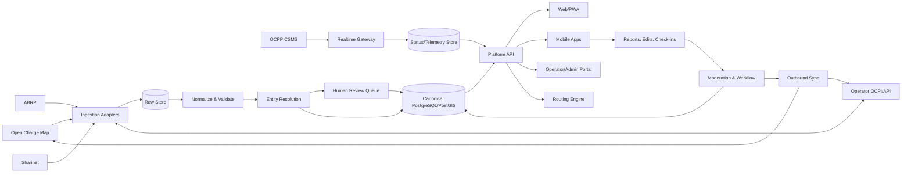
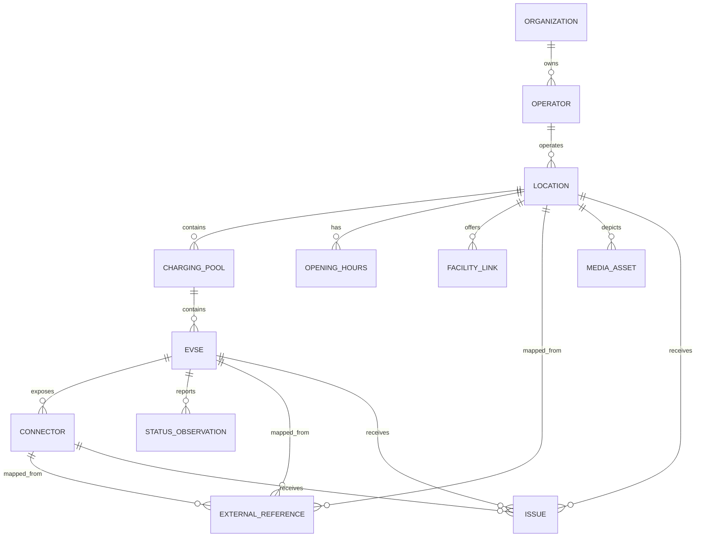

# معماری جامع پلتفرم یکپارچه شارژ خودروهای برقی ایران

> نسخه: 1.0  
> تاریخ: ۱۴۰۵/۰۷/۰۳  
> وضعیت: سند مرجع محصول، داده و پیاده‌سازی  
> دامنه: تجمیع Open Charge Map، ABRP، شارینت و سرویس‌دهندگان آینده؛ مدیریت ایستگاه و تجهیزات؛ جست‌وجو و مسیریابی؛ وضعیت لحظه‌ای؛ قیمت، رزرو، شارژ و پرداخت؛ مشارکت کاربران؛ گزارش خطا؛ همگام‌سازی دوطرفه و عملیات پلتفرم

---

## 1. هدف سند

هدف، ساخت یک پایگاه داده و پلتفرم مرکزی برای تمام زیرساخت‌های شارژ خودروی برقی ایران است که:

- داده چند منبع را بدون از دست رفتن منشأ، تاریخچه یا جزئیات ادغام کند؛
- بین «مکان»، «ایستگاه»، «دستگاه»، «EVSE» و «کانکتور» تمایز صحیح داشته باشد؛
- داده ثابت و وضعیت لحظه‌ای را با چرخه عمر متفاوت نگهداری کند؛
- همکاری مستقیم اپراتورها و سرویس‌دهندگان را پشتیبانی کند؛
- ثبت، اصلاح، تأیید، گزارش خرابی و moderation توسط کاربران را فراهم کند؛
- در آینده رزرو، آغاز شارژ، قیمت‌گذاری، پرداخت، تسویه و roaming را پوشش دهد؛
- با استانداردهای OCPI و OCPP قابل اتصال باشد؛
- به یک API خارجی یا مدل فعلی یک اپراتور وابسته نباشد؛
- تمام تغییرات، ادغام‌ها و تصمیمات را قابل حسابرسی و برگشت نگه دارد.

اصل کلیدی این معماری این است که **رکورد مرکزی جای رکورد منابع را نمی‌گیرد**. هر موجودیت مرکزی می‌تواند به چند رکورد خارجی متصل باشد و مقدار نهایی هر فیلد با provenance و قواعد اعتماد تعیین شود.

---

## 2. اصول معماری

### 2.1. تفکیک لایه‌ها

1. **Raw layer:** پاسخ تغییرنیافته هر منبع، برای audit و پردازش مجدد.
2. **Normalized layer:** تبدیل schema اختصاصی هر منبع به مدل واحد.
3. **Canonical layer:** نمای مورد اعتماد پلتفرم پس از تطبیق و ادغام.
4. **Operational layer:** وضعیت زنده، رزرو، نشست شارژ، قیمت و پرداخت.
5. **Community layer:** پیشنهاد تغییر، گزارش، نظر، تصویر و تأیید کاربران.
6. **Serving layer:** API عمومی، جست‌وجو، نقشه، مسیریابی و پنل اپراتور.

### 2.2. قواعد بنیادین

- شناسه خارجی هرگز شناسه اصلی پلتفرم نیست؛ همه موجودیت‌های مرکزی UUID دارند.
- هر رکورد خارجی با `(source_system_id, entity_type, external_id)` یکتا می‌شود.
- payload خام immutable است و فقط نسخه جدید به آن افزوده می‌شود.
- حذف منبع به‌صورت hard delete به داده مرکزی منتقل نمی‌شود.
- وضعیت لحظه‌ای TTL دارد و پس از انقضا `UNKNOWN/STALE` نمایش داده می‌شود.
- زمان‌ها در دیتابیس UTC و منطقه زمانی مکان جداگانه ذخیره می‌شود.
- مبلغ به‌صورت integer در کوچک‌ترین واحد پولی ذخیره می‌شود؛ float ممنوع است.
- مختصات با PostGIS و SRID 4326 ذخیره می‌شود.
- تمام تغییرات حساس actor، زمان، دلیل و before/after دارند.
- یک Station می‌تواند چند Charging Pool، چند EVSE و هر EVSE چند Connector داشته باشد.
- «تعداد دستگاه» از روی تعداد رکوردهای یک provider استنباط نمی‌شود.
- داده‌های کاربر، داده اپراتور و داده aggregator هیچ‌گاه بدون provenance مخلوط نمی‌شوند.

---

## 3. معماری کلان



### 3.1. اجزای پیشنهادی

- **PostgreSQL + PostGIS:** منبع حقیقت تراکنشی و مکانی.
- **Redis:** cache، rate limit، قفل توزیع‌شده و آخرین وضعیت سریع.
- **Object Storage سازگار با S3:** تصاویر، اسناد و payloadهای بسیار بزرگ.
- **Kafka/Redpanda یا RabbitMQ:** event bus و jobهای ingestion؛ در شروع می‌توان از PostgreSQL queue استفاده کرد.
- **OpenSearch اختیاری:** جست‌وجوی متن فارسی و faceting در مقیاس بالا؛ شروع با PostgreSQL FTS و `pg_trgm` کافی است.
- **TimescaleDB اختیاری:** telemetry حجیم؛ وضعیت‌های کلیدی همچنان در PostgreSQL مرکزی باقی بمانند.
- **API Backend:** معماری modular monolith در شروع، با مرزهای دامنه روشن. microservice زودهنگام توصیه نمی‌شود.

---

## 4. مرز دامنه‌ها

پلتفرم به ماژول‌های زیر تقسیم شود:

1. Identity & Access
2. Organizations & Operators
3. Locations & Charging Infrastructure
4. Source Registry & Ingestion
5. Entity Resolution & Data Quality
6. Realtime Status & Telemetry
7. Tariffs & Pricing
8. Reservations
9. Charging Sessions & CDR
10. Payments, Wallet & Settlement
11. Community Contributions
12. Issues, Incidents & Maintenance
13. Media & Documents
14. Search, Discovery & Routing
15. Notifications
16. Moderation & Administration
17. Audit, Compliance & Observability

هر ماژول مالک جدول‌ها و قوانین خود است، ولی در فاز اول می‌تواند داخل یک codebase و یک PostgreSQL schema اجرا شود.

---

## 5. مدل مفهومی زیرساخت شارژ



### تعریف موجودیت‌ها

- **Location:** محل فیزیکی قابل بازدید؛ مانند پارکینگ طالقانی.
- **Charging Pool:** گروه تجهیزات داخل یک Location، مانند طبقه دوم یا اپراتور مستقل در همان محل.
- **EVSE:** واحد منطقی که معمولاً در یک لحظه به یک خودرو سرویس می‌دهد و status مستقل دارد.
- **Connector:** خروجی فیزیکی یا سوکت یک EVSE، مانند CCS2 یا GB/T DC.
- **Charge Point:** اصطلاح مبهم providerها؛ adapter باید آن را به Pool، EVSE یا Connector صحیح نگاشت کند.

---

## 6. طراحی دیتابیس

نام جدول‌ها انگلیسی، `snake_case` و schemaها بر اساس دامنه باشند. نمونه schemaها:

```text
iam, party, charging, integration, realtime, pricing,
session, payment, community, maintenance, content, audit
```

### 6.1. هویت و دسترسی

#### `iam.users`

| ستون | نوع | توضیح |
|---|---|---|
| id | uuid PK | شناسه داخلی |
| phone_e164 | text nullable unique | شماره استاندارد |
| email | citext nullable unique | ایمیل |
| display_name | text | نام نمایشی |
| locale | text | `fa-IR` |
| timezone | text | منطقه زمانی |
| status | enum | pending, active, suspended, deleted |
| trust_score | numeric | امتیاز اعتماد مشارکت |
| created_at | timestamptz | ایجاد |
| updated_at | timestamptz | تغییر |
| deleted_at | timestamptz | حذف نرم |

#### نقش‌ها

- `iam.roles`
- `iam.permissions`
- `iam.user_roles`
- `iam.organization_memberships`

RBAC برای نقش و ABAC برای اعمال حساس ترکیب شود. نمونه نقش‌ها:

- public_user
- trusted_contributor
- country_editor
- operator_agent
- operator_admin
- support_agent
- finance_admin
- platform_admin

### 6.2. سازمان و اپراتور

#### `party.organizations`

موجودیت حقوقی عمومی: اپراتور، مالک محل، eMSP، سازنده، پیمانکار یا provider داده.

ستون‌های اصلی:

```text
id uuid PK
legal_name
display_name_fa
display_name_en
organization_type
national_id nullable
website_url
support_phone
support_email
country_code
status
created_at, updated_at, deleted_at
```

#### `party.operators`

```text
id uuid PK
organization_id FK
country_code char(2)
party_id char(3) nullable       -- OCPI party id
operator_code text
brand_name_fa, brand_name_en
logo_asset_id nullable
support_contact jsonb
roaming_enabled boolean
status enum
```

قید پیشنهادی:

```text
UNIQUE(country_code, party_id) WHERE party_id IS NOT NULL
```

### 6.3. Location

#### `charging.locations`

```text
id uuid PK
operator_id uuid nullable FK
owner_organization_id uuid nullable FK
canonical_name_fa text
canonical_name_en text nullable
slug text unique
location_type enum
publish_status enum
operational_status enum
access_type enum
is_24_7 boolean
is_public boolean
is_reservable boolean
is_remote boolean
timezone text default 'Asia/Tehran'
coordinates geography(Point,4326)
entrance_coordinates geography(Point,4326) nullable
navigation_coordinates geography(Point,4326) nullable
elevation_m numeric nullable
address_id uuid FK
parking_type enum nullable
parking_restrictions text[]
directions_fa text nullable
directions_en text nullable
website_url text nullable
phone text nullable
email citext nullable
data_quality_score numeric(5,2)
verification_status enum
last_verified_at timestamptz nullable
verified_by uuid nullable
commissioned_at date nullable
decommissioned_at date nullable
created_at, updated_at, deleted_at
row_version bigint
```

انواع `location_type`:

```text
on_street, parking_garage, parking_lot, fuel_station,
service_area, shopping_center, hotel, restaurant, workplace,
dealership, residential, airport, bus_terminal, other
```

#### `charging.addresses`

```text
id uuid PK
country_code
province
county
city
district
neighborhood
street
plaque
postal_code
formatted_address_fa
formatted_address_en
geocoding_provider
geocoding_precision
```

آدرس از Location جداست تا اصلاح geocoding و ساخت نسخه‌های فارسی/انگلیسی ساده باشد.

### 6.4. Pool، EVSE و Connector

#### `charging.charging_pools`

```text
id uuid PK
location_id uuid FK
operator_id uuid FK
name
floor_level
physical_reference
access_instructions
status
created_at, updated_at, deleted_at
```

#### `charging.evses`

```text
id uuid PK
pool_id uuid FK
operator_id uuid FK
evse_uid text nullable
evse_id text nullable            -- شناسه چاپ‌شده/OCPI
physical_reference text nullable
capabilities text[]
parking_restrictions text[]
floor_level text nullable
coordinates geography(Point,4326) nullable
max_power_w integer nullable
status enum
status_source_id uuid nullable
status_updated_at timestamptz nullable
status_expires_at timestamptz nullable
is_reservable boolean
commissioned_at date nullable
decommissioned_at date nullable
created_at, updated_at, deleted_at
```

`evse_uid` در محدوده operator یکتا شود، نه در کل دنیا:

```text
UNIQUE(operator_id, evse_uid) WHERE evse_uid IS NOT NULL
```

#### `charging.connectors`

```text
id uuid PK
evse_id uuid FK
connector_index smallint
standard enum
format enum                    -- SOCKET, CABLE
power_type enum                -- AC_1_PHASE, AC_3_PHASE, DC
max_voltage integer nullable
max_amperage integer nullable
max_electric_power_w integer nullable
max_power_kw_generated numeric generated/derived
status enum nullable
terms_and_conditions_url text nullable
created_at, updated_at, deleted_at
```

قیدها:

```text
UNIQUE(evse_id, connector_index)
CHECK(max_voltage > 0)
CHECK(max_amperage > 0)
CHECK(max_electric_power_w > 0)
```

استانداردهای اولیه کانکتور:

```text
TYPE_1, TYPE_2, TYPE_2_CABLE, CCS_1, CCS_2,
CHADEMO, GBT_AC, GBT_DC, NACS, TESLA, SCHUKO,
DOMESTIC, PANTOGRAPH_TOP_DOWN, PANTOGRAPH_BOTTOM_UP, UNKNOWN
```

Catalog کانکتورها بهتر است table-driven باشد تا اضافه‌شدن استاندارد جدید migration دشوار نخواهد.

### 6.5. ساعات کار و تعطیلی استثنایی

- `charging.opening_hours`: بازه عادی هر روز هفته.
- `charging.exceptional_openings`: بازه‌های باز استثنایی.
- `charging.exceptional_closings`: تعطیلی استثنایی.

هر بازه `start_local_time` و `end_local_time` دارد. از ذخیره متن صرف مانند «همه روزها» به‌عنوان تنها داده خودداری شود؛ متن اصلی در source record باقی بماند.

### 6.6. امکانات و دسترسی‌پذیری

- `charging.facilities`: کاتالوگ؛ رستوران، کافه، سرویس بهداشتی، هتل، فروشگاه، نمازخانه، Wi-Fi و غیره.
- `charging.location_facilities`: اتصال location به facility همراه با فاصله و وضعیت تأیید.
- `charging.accessibility_features`: رمپ، محل ویلچر، نور، ارتفاع نمایشگر و غیره.
- `charging.energy_sources`: انرژی تجدیدپذیر و ترکیب انرژی در صورت ارائه اپراتور.

### 6.7. شناسه‌ها و رکوردهای خارجی

#### `integration.source_systems`

```text
id uuid PK
code unique                    -- ocm, abrp, sharinet, operator_x
name
source_type enum              -- aggregator, cpo, emsp, community, government
base_url
trust_level smallint
default_priority smallint
license_id nullable
active boolean
configuration_encrypted jsonb
created_at, updated_at
```

secret واقعی نباید در این جدول plaintext باشد؛ فقط reference به Secret Manager نگهداری شود.

#### `integration.external_records`

```text
id uuid PK
source_system_id uuid FK
entity_type enum
external_id text
external_parent_id text nullable
canonical_entity_type enum nullable
canonical_entity_id uuid nullable
source_updated_at timestamptz nullable
first_seen_at timestamptz
last_seen_at timestamptz
last_fetched_at timestamptz
is_present_at_source boolean
is_tombstone boolean
content_hash text
schema_version text nullable
license_id uuid nullable
attribution_text text nullable
raw_object_key text nullable
raw_payload jsonb nullable
normalized_payload jsonb
validation_status enum
validation_errors jsonb
```

قید حیاتی:

```text
UNIQUE(source_system_id, entity_type, external_id)
```

#### `integration.external_links`

برای linkageهایی مانند ABRP → OCM:

```text
id
left_external_record_id
right_external_record_id
relation_type       -- SAME_AS, PARENT_OF, IMPORTED_FROM, SUPERSEDES
confidence
evidence jsonb
created_by
created_at
```

### 6.8. provenance در سطح فیلد

برای فیلدهای مهم، فقط provenance سطح entity کافی نیست.

#### `integration.field_assertions`

```text
id uuid PK
entity_type
entity_id
field_path                    -- address.city, coordinates, canonical_name_fa
value_json
source_record_id nullable
asserted_by_user_id nullable
asserted_by_org_id nullable
assertion_type                -- observed, imported, user_reported, inferred
confidence numeric(5,4)
valid_from timestamptz
valid_to timestamptz nullable
observed_at timestamptz
created_at timestamptz
```

#### `integration.canonical_field_values`

نمای انتخاب‌شده هر فیلد:

```text
entity_type, entity_id, field_path
selected_assertion_id
selection_method              -- automatic, operator_override, moderator_override
selected_at
selected_by nullable
```

این مدل اجازه می‌دهد مختصات از اپراتور، نام از ویرایشگر و امکانات از کاربران انتخاب شود، بدون نابود کردن مقادیر دیگر.

---

## 7. داده لحظه‌ای و telemetry

### 7.1. وضعیت‌ها

enum داخلی پیشنهادی، سازگار با OCPI:

```text
AVAILABLE
BLOCKED
CHARGING
INOPERATIVE
OUTOFORDER
PLANNED
REMOVED
RESERVED
UNKNOWN
STALE
```

هر adapter وضعیت خارجی را با mapping versioned به enum داخلی تبدیل می‌کند.

#### `realtime.status_observations`

```text
id bigserial / uuid
evse_id uuid FK
connector_id uuid nullable
source_system_id uuid FK
external_status text
normalized_status enum
observed_at timestamptz
received_at timestamptz
valid_until timestamptz nullable
confidence numeric
payload_reference text nullable
```

برای حجم بالا partition ماهانه روی `observed_at` ایجاد شود.

#### `realtime.current_evse_status`

جدول یا materialized projection سریع:

```text
evse_id PK
status
winning_observation_id
observed_at
expires_at
is_stale
```

قواعد انتخاب وضعیت:

1. feed مستقیم اپراتور؛
2. OCPP مستقیم؛
3. aggregator دارای dynamic status؛
4. گزارش کاربر تازه و معتبر؛
5. آخرین status ثابت؛
6. UNKNOWN.

گزارش کاربر نباید status مستقیم OCPP با timestamp جدیدتر را بدون review کنار بزند، مگر گزارش safety-critical باشد.

### 7.2. OCPP

OCPP مربوط به ارتباط دستگاه و CSMS است و نباید با OCPI اشتباه شود.

پشتیبانی آینده:

- OCPP 1.6J برای بازار موجود؛
- OCPP 2.0.1 برای نصب‌های جدید؛
- BootNotification و inventory؛
- StatusNotification؛
- MeterValues؛
- Start/StopTransaction یا TransactionEvent؛
- RemoteStart/RemoteStop؛
- Reset، UnlockConnector و diagnostics؛
- firmware و device management.

داده خام OCPP در event store کوتاه‌مدت و داده تجمیع‌شده meter در storage زمانی نگهداری شود. هر پیام دارای charge_point_identity، message_id و correlation_id باشد.

### 7.3. telemetry کنتور

`realtime.meter_values`:

```text
evse_id
connector_id nullable
session_id nullable
timestamp
measurand
phase nullable
location nullable
unit
value numeric
source
```

retention پیشنهادی:

- raw telemetry پرتکرار: ۳ تا ۱۲ ماه بر اساس قرارداد؛
- rollup پنج‌دقیقه‌ای: ۲ سال؛
- مقادیر billing و CDR: مطابق الزامات مالی، بدون حذف زودهنگام.

---

## 8. تعرفه و قیمت‌گذاری

مدل باید بیشتر از «قیمت هر kWh» را پوشش دهد.

#### `pricing.tariffs`

```text
id uuid PK
operator_id uuid FK
external_tariff_id text nullable
currency char(3)              -- IRR در ذخیره استاندارد
currency_exponent smallint
tax_included boolean
type enum                     -- REGULAR, PROFILE_CHEAP, PROFILE_FAST, AD_HOC
min_price_minor bigint nullable
max_price_minor bigint nullable
valid_from timestamptz nullable
valid_to timestamptz nullable
status enum
source_record_id uuid nullable
created_at, updated_at
```

#### `pricing.tariff_elements`

هر tariff چند element با restriction دارد.

#### `pricing.price_components`

```text
element_id
dimension_type               -- ENERGY, TIME, PARKING_TIME, FLAT
price_minor bigint
step_size integer
vat_rate numeric nullable
```

#### `pricing.tariff_restrictions`

```text
start_time, end_time
start_date, end_date
min_kwh, max_kwh
min_current, max_current
min_power, max_power
min_duration, max_duration
day_of_week[]
reservation enum nullable
```

اتصال تعرفه:

- `pricing.location_tariffs`
- `pricing.evse_tariffs`
- `pricing.connector_tariffs`

قیمت snapshot شارینت (`plan.cost`) به‌صورت observation با timestamp ذخیره شود؛ تعرفه خام و قیمت محاسبه‌شده دو مفهوم جدا هستند.

واحد نمایشی تومان می‌تواند در UI استفاده شود، اما مبلغ اصلی با currency و minor unit روشن نگهداری شود. تبدیل ریال/تومان باید صریح و تست‌شده باشد.

---

## 9. رزرو

#### `session.reservations`

```text
id uuid PK
user_id uuid FK
operator_id uuid FK
location_id uuid FK
evse_id uuid nullable FK
connector_id uuid nullable FK
external_reservation_id text nullable
status enum
start_at, expires_at
authorization_reference
price_quote_id nullable
cancellation_reason nullable
source enum
idempotency_key text
created_at, updated_at
```

وضعیت‌ها:

```text
PENDING, CONFIRMED, ACTIVE, COMPLETED, CANCELLED,
EXPIRED, REJECTED, FAILED
```

رزرو باید state machine داشته باشد. درخواست تکراری با `idempotency_key` رزرو دوم نسازد.

---

## 10. نشست شارژ و CDR

#### `session.charging_sessions`

```text
id uuid PK
operator_id
user_id nullable
credential_id nullable
location_id
evse_id
connector_id
external_session_id nullable
authorization_method
status
started_at
ended_at nullable
energy_wh bigint default 0
current_cost_minor bigint nullable
currency char(3)
meter_start_wh bigint nullable
meter_stop_wh bigint nullable
last_meter_at nullable
reservation_id nullable
source_system_id
created_at, updated_at
```

وضعیت‌ها:

```text
PENDING_AUTHORIZATION, AUTHORIZED, STARTING, ACTIVE,
STOPPING, COMPLETED, FAILED, INVALID
```

#### `session.cdrs`

CDR رکورد مالی نهایی و immutable است:

```text
id
session_id
external_cdr_id
start_at, end_at
energy_wh
duration_seconds
parking_seconds
total_energy_cost_minor
total_time_cost_minor
total_parking_cost_minor
total_fixed_cost_minor
total_tax_minor
total_cost_minor
currency
tariff_snapshot jsonb
signed_data jsonb nullable
issued_at
```

ویرایش CDR باید با adjustment/credit record انجام شود، نه overwrite.

---

## 11. پرداخت، کیف پول و تسویه

جداول اصلی:

- `payment.customers`
- `payment.wallets`
- `payment.ledger_accounts`
- `payment.ledger_entries`
- `payment.payment_intents`
- `payment.transactions`
- `payment.refunds`
- `payment.invoices`
- `payment.operator_settlements`
- `payment.payouts`

کیف پول حتماً double-entry ledger باشد. `wallet.balance` تنها cache است و منبع حقیقت نیست.

هر عملیات مالی باید:

- idempotency key؛
- reference درگاه؛
- وضعیت state-machine؛
- مبلغ integer؛
- currency؛
- audit trail؛
- reconciliation روزانه داشته باشد.

اطلاعات کارت بانکی نباید در سیستم ذخیره شود؛ فقط token/reference درگاه مجاز است.

---

## 12. مشارکت کاربران و ثبت شارژر

### 12.1. Change proposal به‌جای ویرایش مستقیم

#### `community.change_proposals`

```text
id uuid PK
target_entity_type
target_entity_id nullable       -- null برای ثبت جدید
proposal_type                  -- CREATE, UPDATE, MERGE, SPLIT, DELETE, VERIFY
patch jsonb                    -- JSON Patch یا مدل typed
base_row_version bigint nullable
submitted_by_user_id
submitted_by_org_id nullable
source_evidence jsonb
status enum
risk_level enum
auto_validation_result jsonb
reviewed_by nullable
reviewed_at nullable
decision_reason nullable
created_at, updated_at
```

وضعیت‌ها:

```text
DRAFT, SUBMITTED, AUTO_APPROVED, NEEDS_REVIEW,
APPROVED, PARTIALLY_APPROVED, REJECTED, WITHDRAWN, SUPERSEDED
```

### 12.2. ثبت ایستگاه جدید

فرآیند:

1. مختصات و عکس یا مدرک؛
2. جست‌وجوی خودکار ایستگاه‌های نزدیک؛
3. هشدار duplicate؛
4. مشخصات location؛
5. تعریف EVSE و connector؛
6. ساعات و دسترسی؛
7. اطلاعات اپراتور؛
8. validation؛
9. انتشار موقت یا صف moderation؛
10. همگام‌سازی با providerهای انتخاب‌شده.

ثبت کاربران عادی ابتدا `UNVERIFIED` است. ثبت مستقیم اپراتور تأییدشده می‌تواند auto-approved باشد، مگر با رکورد موجود conflict جدی داشته باشد.

### 12.3. Check-in و تجربه شارژ

#### `community.checkins`

```text
id
user_id
location_id
evse_id nullable
connector_id nullable
result                       -- SUCCESS, FAILED, WAITING, VISITED_ONLY
charged boolean
energy_wh nullable
wait_minutes nullable
comment nullable
occurred_at
created_at
visibility
```

اطلاعات دقیق نشست خصوصی نباید بدون رضایت عمومی شود.

### 12.4. نظر و امتیاز

- امتیاز کلی، قابلیت اطمینان، دسترسی، امنیت و امکانات جدا باشد.
- فقط کاربر دارای check-in یا session معتبر علامت `verified charging` بگیرد.
- میانگین Bayesian برای جلوگیری از اثر یک رأی استفاده شود.
- review حذف نرم و moderation log داشته باشد.

---

## 13. گزارش اشتباه، خرابی و incident

یک مدل issue عمومی برای تمام موضوعات:

#### `maintenance.issues`

```text
id uuid PK
reporter_user_id nullable
reporter_org_id nullable
target_type                   -- LOCATION, EVSE, CONNECTOR, TARIFF, MEDIA, DATA
target_id uuid
category
severity
title
description
status
visibility
occurred_at nullable
first_reported_at
last_reported_at
assigned_organization_id nullable
assigned_user_id nullable
resolution_code nullable
resolution_note nullable
resolved_at nullable
duplicate_of_id nullable
source_system_id nullable
external_issue_id nullable
created_at, updated_at
```

دسته‌ها:

```text
WRONG_LOCATION
WRONG_ADDRESS
WRONG_CONNECTOR
WRONG_POWER
WRONG_PRICE
WRONG_OPENING_HOURS
DUPLICATE
DOES_NOT_EXIST
TEMPORARILY_CLOSED
DECOMMISSIONED
CONNECTOR_BROKEN
PAYMENT_FAILED
APP_AUTH_FAILED
CABLE_STUCK
DISPLAY_BROKEN
BLOCKED_BY_VEHICLE
ACCESS_DENIED
SAFETY_HAZARD
VANDALISM
OTHER
```

شدت:

```text
INFO, MINOR, MAJOR, CRITICAL, SAFETY_CRITICAL
```

چرخه عمر:

```text
OPEN → TRIAGED → ASSIGNED → IN_PROGRESS → RESOLVED → VERIFIED → CLOSED
                         ↘ REJECTED
OPEN → DUPLICATE
```

جداول همراه:

- `maintenance.issue_events`: تمام تغییر وضعیت‌ها و پیام‌ها.
- `maintenance.issue_evidence`: تصویر، ویدئو، log و session reference.
- `maintenance.issue_confirmations`: تأیید یا رد توسط کاربران دیگر.
- `maintenance.work_orders`: مأموریت تعمیر اپراتور.
- `maintenance.maintenance_windows`: قطعی برنامه‌ریزی‌شده.

گزارش‌های متعدد مشابه با فاصله زمانی و مکانی نزدیک، به یک issue اصلی cluster شوند ولی گزارش‌های اولیه حذف نشوند.

گزارش safety-critical باید فوراً alert اپراتور ایجاد کند و در صورت سیاست تعریف‌شده، status نمایشی را به هشدار ایمنی تغییر دهد.

---

## 14. رسانه

#### `content.media_assets`

```text
id uuid PK
owner_user_id nullable
owner_org_id nullable
media_type
storage_key
original_filename
mime_type
byte_size
width, height
sha256
perceptual_hash nullable
license_id
attribution
captured_at nullable
coordinates nullable
moderation_status
virus_scan_status
created_at, deleted_at
```

#### `content.media_links`

اتصال media به location، issue، review، connector یا proposal با نقش‌هایی مانند `ENTRANCE`, `CHARGER`, `CONNECTOR`, `PARKING`, `EVIDENCE`.

pipeline رسانه:

1. upload با URL امضاشده؛
2. antivirus؛
3. حذف EXIF حساس در نسخه عمومی؛
4. ساخت thumbnail و WebP/AVIF؛
5. بررسی محتوایی؛
6. dedup با SHA-256 و perceptual hash؛
7. انتشار CDN.

---

## 15. ادغام و حذف تکراری‌ها

### 15.1. مراحل Entity Resolution

1. **Deterministic linking:** شناسه یا لینک صریح مشترک.
2. **Blocking:** محدودکردن candidateها با geohash/H3، شهر و اپراتور.
3. **Feature extraction:** فاصله، نام، آدرس، اپراتور، توان و کانکتورها.
4. **Scoring:** امتیاز و confidence.
5. **Decision:** auto-link، human review یا separate.
6. **Canonicalization:** انتخاب field assertion برنده.
7. **Continuous reevaluation:** اجرای مجدد پس از داده جدید.

### 15.2. linkageهای قطعی فعلی

برای ABRP در صورتی که:

```json
{
  "source": "ocm",
  "editableUrl": "https://openchargemap.org/site/poi/edit/478465"
}
```

رکورد ABRP مستقیماً به OCM ID `478465` متصل شود. این دو Location جدا ساخته نشوند.

### 15.3. نرمال‌سازی فارسی

- `ي → ی` و `ك → ک`؛
- ارقام عربی و فارسی به لاتین برای matching؛
- حذف اعراب و کشیده؛
- یکسان‌سازی نیم‌فاصله؛
- collapse فاصله‌ها؛
- حذف prefixهای کم‌اطلاعات مانند «ایستگاه شارژ» فقط در نسخه matching؛
- نگهداری متن اصلی برای نمایش؛
- alias برای نام قدیم و محلی.

### 15.4. امتیاز اولیه پیشنهادی

| سیگنال | امتیاز |
|---|---:|
| لینک صریح SAME_AS | تطبیق قطعی |
| external reference مشترک | +100 |
| فاصله تا ۲۰ متر | +40 |
| فاصله ۲۰ تا ۵۰ متر | +30 |
| فاصله ۵۰ تا ۱۰۰ متر | +15 |
| شباهت نام بیشتر از ۰٫۹ | +30 |
| شباهت نام ۰٫۷۵ تا ۰٫۹ | +20 |
| اپراتور یکسان | +15 |
| آدرس مشابه | +15 |
| مجموعه کانکتور مشابه | +10 |
| پروفایل توان مشابه | +10 |
| تضاد اپراتور | -25 |
| فاصله بیشتر از ۵۰۰ متر | -50 |

threshold اولیه:

- `>= 80`: اتصال خودکار؛
- `55..79`: review انسانی؛
- `< 55`: جدا؛
- هر تضاد ساختاری مهم، حتی با امتیاز بالا، review می‌خواهد.

thresholdها باید با مجموعه truth دستی ایران کالیبره شوند.

### 15.5. Merge و Split

#### `integration.entity_merge_events`

```text
id
entity_type
survivor_id
merged_entity_id
reason
evidence
performed_by
performed_at
reverted_at nullable
```

merge نباید destructive باشد. شناسه قدیمی alias می‌شود و redirect API می‌گیرد. split نیز باید رابطه external recordها را دوباره تخصیص دهد. تمام عملیات قابل برگشت باشند.

---

## 16. قواعد اعتماد و انتخاب داده

priority در سطح field تعریف شود، نه فقط source.

| داده | اولویت معمول |
|---|---|
| وضعیت زنده | OCPP/اپراتور مستقیم، شارینت، aggregator، کاربر |
| قیمت | اپراتور/شارینت، قرارداد رسمی، aggregator |
| مختصات | اپراتور تأییدشده، ویرایشگر معتبر، OCM، سایر |
| کانکتور/توان | inventory اپراتور، inspection معتبر، OCM |
| نام و آدرس | اپراتور + moderation محلی |
| ساعات کار | اپراتور، مالک محل، کاربران تأییدشده |
| تصویر | اپراتور یا کاربر با مجوز روشن |

قواعد conflict:

- داده جدیدتر همیشه بهتر نیست؛ trust و نوع داده مهم است.
- override دستی moderator تاریخ انقضا یا دلیل داشته باشد.
- اپراتور روی تجهیزات خودش authoritative است، ولی اشتباه آشکار می‌تواند flag شود.
- داده inferred هرگز بدون علامت به‌عنوان observed نمایش داده نشود.

---

## 17. ingestion هر منبع

### 17.1. قرارداد مشترک Adapter

هر adapter این interface منطقی را پیاده کند:

```text
discover(cursor/checkpoint) -> external IDs
fetch(external_id) -> raw payload
normalize(raw) -> normalized entities
validate(normalized) -> validation result
emit(records/events)
healthcheck() -> source health
```

ویژگی‌ها:

- timeout و retry با exponential backoff؛
- rate limiting اختصاصی هر provider؛
- circuit breaker؛
- checkpoint؛
- idempotency؛
- content hash برای جلوگیری از پردازش تکراری؛
- dead-letter queue؛
- schema drift alert؛
- metrics برای latency، error و freshness.

### 17.2. Open Charge Map

- دریافت POIهای ایران با country code یا bounding box؛
- cache reference data؛
- حفظ `DataProviderID` و مجوز هر POI؛
- نگاشت `AddressInfo` به Location؛
- نگاشت `Connections` به EVSE/Connector با احتیاط؛
- نگهداری comments و media با attribution؛
- استفاده از `DateLastVerified`, `DateLastStatusUpdate`, `StatusTypeID`؛
- sync خروجی تغییرات تأییدشده در صورت سیاست همکاری.

OCM ممکن است EVSE واقعی را به‌صورت کامل تفکیک نکرده باشد؛ adapter نباید یک Connection را بدون شواهد کافی EVSE مستقل فرض کند.

### 17.3. ABRP

- استفاده از search/bounding box برای discover؛
- دریافت detail گروهی؛
- نگاشت `source=ocm` به رکورد OCM؛
- حفظ ABRP charger ID به‌عنوان external reference؛
- استفاده از `hasDynamicStatus` و occupancy فقط با freshness؛
- نگهداری network و EVSE ID؛
- ABRP-derived fields با provenance جدا.

### 17.4. شارینت

- `/api/charger/filter/v2` برای inventory و status کلی؛
- `/api/charger/filter/v2/getStation` برای detail، connector، قیمت و امکانات؛
- هر رکورد list ابتدا external charge point است، نه Location قطعی؛
- clustering رکوردهای هم‌نام و نزدیک برای ساخت Location/Pool؛
- نگاشت connector status و timestamp؛
- `plan.cost` به‌عنوان price observation؛
- `tariff` به‌عنوان base tariff؛
- حفظ تصاویر و شرایط مجوز؛
- استفاده از WebSocket رسمی در صورت ارائه برای status زنده.

### 17.5. اپراتورهای همکار

اولویت اتصال:

1. OCPI 2.2.1/2.3؛
2. webhook/event stream رسمی؛
3. REST رسمی با incremental sync؛
4. SFTP/object snapshot versioned؛
5. پنل ورود دستی برای اپراتور کوچک.

---

## 18. OCPI و roaming

پشتیبانی دامنه‌های زیر طراحی شود:

- Credentials
- Locations
- Tariffs
- Tokens
- Sessions
- CDRs
- Commands
- Reservations، در نسخه/extension مناسب

`country_code + party_id + external ID` باید حفظ شود. endpointهای inbound و outbound جدا و credentialهای هر partner مستقل باشند.

قواعد مهم:

- pagination؛
- date_from/date_to؛
- version negotiation؛
- request/response log با حذف secrets؛
- retry امن و idempotent؛
- clock skew handling؛
- OCPI response status mapping؛
- عدم وابستگی canonical ID به OCPI ID.

---

## 19. API داخلی و عمومی

نسخه‌گذاری URL یا media type؛ پیشنهاد اولیه `/v1`.

### Discovery

```http
GET /v1/locations?bbox=&connector=&min_power_kw=&status=&operator=
GET /v1/locations/nearby?lat=&lng=&radius_m=
GET /v1/locations/{id}
GET /v1/locations/{id}/availability
GET /v1/locations/{id}/tariffs
GET /v1/search?q=
```

### Community

```http
POST /v1/location-proposals
POST /v1/locations/{id}/change-proposals
POST /v1/issues
POST /v1/issues/{id}/confirmations
POST /v1/checkins
POST /v1/reviews
POST /v1/media/uploads
```

### عملیات شارژ

```http
POST /v1/reservations
DELETE /v1/reservations/{id}
POST /v1/charging-sessions/start
POST /v1/charging-sessions/{id}/stop
GET /v1/charging-sessions/{id}
POST /v1/payment-intents
```

### اپراتور

```http
POST /v1/operator/locations
PATCH /v1/operator/locations/{id}
POST /v1/operator/evses/{id}/status
POST /v1/operator/tariffs
GET /v1/operator/issues
PATCH /v1/operator/issues/{id}
```

### اصول API

- cursor pagination؛
- ETag و `If-None-Match`؛
- idempotency key برای POSTهای حساس؛
- problem details استاندارد برای خطا؛
- field mask برای پاسخ‌های سنگین؛
- rate limit بر اساس client؛
- trace ID در تمام پاسخ‌ها؛
- decimal/money بدون float؛
- مختصات با `lat`, `lng` در API و geography در DB؛
- backward compatibility و deprecation policy.

---

## 20. جست‌وجو و نقشه

قابلیت‌های query:

- viewport/bounding box؛
- فاصله از کاربر یا مسیر؛
- connector سازگار؛
- حداقل توان؛
- AC/DC؛
- وضعیت زنده؛
- اپراتور؛
- عمومی/خصوصی؛
- ۲۴ ساعته؛
- قیمت یا رایگان؛
- رزروپذیر؛
- امکانات؛
- سطح اعتماد و تازگی داده.

indexهای پیشنهادی:

```sql
CREATE INDEX locations_coordinates_gix
ON charging.locations USING gist (coordinates);

CREATE INDEX locations_name_trgm_idx
ON charging.locations USING gin (canonical_name_fa gin_trgm_ops);
```

برای map clustering می‌توان H3/geohash cache و vector tile endpoint ساخت. تعداد marker خام برای کل کشور یکجا به client ارسال نشود.

---

## 21. مسیریابی خودروی برقی

مدل خودرو:

- ظرفیت باتری usable؛
- SOC فعلی و SOC هدف؛
- منحنی مصرف بر اساس سرعت و دما؛
- منحنی شارژ؛
- connectorهای سازگار؛
- حداکثر توان AC/DC؛
- وزن و بار اختیاری.

route planner باید:

- مسیر پایه را از routing engine بگیرد؛
- ایستگاه‌های سازگار اطراف corridor را پیدا کند؛
- availability و reliability را وزن دهد؛
- زمان شارژ و انحراف را محاسبه کند؛
- ایستگاه جایگزین پیشنهاد دهد؛
- stale بودن وضعیت را در confidence مسیر لحاظ کند.

مدل reliability از uptime، گزارش موفق، خرابی، freshness و تعداد connectorهای جایگزین ساخته شود؛ نه صرفاً status فعلی.

---

## 22. تاریخچه، audit و temporal data

#### `audit.audit_events`

```text
id
actor_type
actor_id
organization_id nullable
action
entity_type
entity_id
request_id
ip_hash nullable
user_agent nullable
before_json nullable
after_json nullable
reason nullable
created_at
```

برای جدول‌های canonical مهم، history یا event ثبت شود. حداقل تغییرات Location، EVSE، Connector، Tariff، Issue و نقش‌های دسترسی قابل حسابرسی باشند.

تفکیک زمان:

- `occurred_at`: زمان رخداد در دنیای واقعی؛
- `observed_at`: زمان مشاهده منبع؛
- `received_at`: زمان رسیدن به سیستم؛
- `created_at`: زمان درج رکورد؛
- `valid_from/valid_to`: بازه اعتبار کسب‌وکاری.

این تفکیک در رفع داده دیررس و conflict ضروری است.

---

## 23. کیفیت داده

برای هر Location یک `data_quality_score` از مؤلفه‌های زیر محاسبه شود:

- completeness؛
- freshness؛
- source trust؛
- verification؛
- تعداد تأیید مستقل؛
- نبود conflict؛
- دقت مختصات؛
- موفقیت check-in اخیر.

پرچم‌های کیفیت:

```text
MISSING_COORDINATES
SUSPICIOUS_COORDINATES
MISSING_CONNECTORS
POWER_CONFLICT
STATUS_STALE
PRICE_STALE
POSSIBLE_DUPLICATE
UNVERIFIED_OPERATOR
ADDRESS_COORDINATE_MISMATCH
SOURCE_DISAPPEARED
```

داشبورد کیفیت باید queueهای قابل اقدام برای moderator و اپراتور بسازد.

---

## 24. امنیت و حریم خصوصی

- OAuth2/OIDC و token کوتاه‌عمر؛
- MFA برای اپراتور و ادمین؛
- secret manager برای کلید providerها؛
- TLS و encryption at rest؛
- محدودسازی دسترسی tenant/organization؛
- rate limit و bot protection؛
- webhook signature و replay protection؛
- idempotency برای commandها؛
- عدم log کردن token، شماره کارت یا payload حساس؛
- تفکیک PII از داده عمومی؛
- retention و حذف حساب؛
- export داده کاربر؛
- moderation و anti-abuse؛
- malware scanning رسانه؛
- backup رمزگذاری‌شده و restore drill.

موقعیت زنده کاربر فقط برای سرویس درخواستی استفاده شود و به‌صورت پیش‌فرض history دائمی نسازد. داده مسیر و نشست شارژ داده شخصی محسوب شود.

---

## 25. multi-tenancy و همکاری اپراتورها

داده عمومی canonical مشترک است، ولی عملیات اپراتور tenant-scoped است.

- هر کاربر اپراتور membership در organization دارد.
- Row-Level Security یا enforcement در service layer الزامی است.
- اپراتور فقط تجهیزات، تعرفه، issue و session مجاز خود را مدیریت می‌کند.
- platform admin امکان merge و حل conflict بین providerها دارد.
- قرارداد هر partner مشخص می‌کند چه داده‌ای public، partner-only یا private است.
- ownership انتقال‌پذیر باشد؛ تغییر اپراتور نباید Location ID عمومی را تغییر دهد.

---

## 26. eventها

eventهای دامنه پیشنهادی:

```text
location.created
location.updated
location.verified
evse.status.changed
evse.status.stale
tariff.updated
reservation.created
reservation.expired
session.started
session.updated
session.completed
payment.succeeded
payment.failed
issue.reported
issue.assigned
issue.resolved
proposal.submitted
proposal.approved
source.sync.completed
source.schema_drift.detected
possible_duplicate.detected
```

برای انتشار قابل اعتماد از Transactional Outbox استفاده شود:

- تغییر DB و درج outbox در یک transaction؛
- worker event را منتشر می‌کند؛
- consumerها idempotent هستند؛
- event دارای `event_id`, `event_type`, `occurred_at`, `aggregate_id`, `version`, `correlation_id` است.

---

## 27. observability و SLO

metrics ضروری:

- freshness هر منبع؛
- درصد sync موفق؛
- تعداد schema error؛
- status latency؛
- coverage استان‌ها؛
- duplicate candidateها؛
- issue resolution time؛
- API latency/error rate؛
- session start success؛
- payment reconciliation mismatch؛
- stale availability ratio.

SLOهای نمونه:

- API خواندنی: 99.9% ماهانه؛
- p95 جست‌وجوی nearby کمتر از 500ms؛
- انتشار status اپراتور تا کاربر کمتر از 15s؛
- عدم نمایش availability بعد از TTL؛
- قابلیت بازیابی point-in-time دیتابیس؛
- RPO حداکثر 5 دقیقه برای عملیات و RTO حداکثر 60 دقیقه در فاز تجاری.

هر request و job `trace_id` داشته باشد و log ساختاریافته باشد.

---

## 28. backup، retention و disaster recovery

- backup روزانه کامل و WAL/PITR؛
- replica در failure domain جدا؛
- object storage versioning؛
- تست restore فصلی؛
- checksum و integrity check؛
- runbook قطعی provider، دیتابیس و payment gateway؛
- retention مستقل برای raw payload، telemetry، audit، مالی و PII؛
- hard delete فقط طبق policy و با job کنترل‌شده.

---

## 29. استراتژی migration و فازهای اجرا

### فاز صفر: Foundations

- PostgreSQL/PostGIS؛
- migration framework؛
- schemas و enum/catalogها؛
- IAM پایه؛
- source registry؛
- raw ingestion و audit؛
- CI/CD، secrets و observability.

### فاز یک: دیتابیس ملی و نقشه

- adapterهای OCM، شارینت و ABRP؛
- Location/Pool/EVSE/Connector؛
- dedup و review queue؛
- API نقشه، detail و search؛
- provenance و attribution؛
- پنل admin داده.

### فاز دو: جامعه و کیفیت

- ثبت شارژر؛
- change proposal؛
- issue/report؛
- check-in، review و media؛
- trust score و moderation؛
- sync اصلاحات به منابع همکار.

### فاز سه: اپراتور و realtime

- portal اپراتور؛
- OCPI inbound/outbound؛
- status stream؛
- maintenance workflow؛
- tariff model؛
- notification؛
- SLA dashboard.

### فاز چهار: عملیات شارژ

- token و authorization؛
- reservation؛
- remote start/stop؛
- session و meter value؛
- CDR؛
- payment، invoice و settlement.

### فاز پنج: مسیریابی پیشرفته

- vehicle profiles؛
- consumption model؛
- charger-aware routing؛
- reliability prediction؛
- availability forecasting؛
- roaming گسترده.

---

## 30. آزمون‌ها

### آزمون داده

- contract test برای هر API منبع؛
- fixture واقعی versioned؛
- schema drift test؛
- property-based test برای normalization؛
- golden dataset برای dedup؛
- تست مختصات و فاصله؛
- تست فارسی‌سازی و fuzzy match؛
- تست mapping status/connector.

### آزمون دامنه

- state machine رزرو و session؛
- tariff calculation؛
- ریال/تومان؛
- idempotency؛
- late/out-of-order event؛
- stale status؛
- merge/split/revert؛
- ledger balance؛
- permission isolation.

### آزمون عملیاتی

- load test نقشه؛
- chaos برای قطع provider؛
- retry storm؛
- failover DB؛
- backup restore؛
- webhook replay؛
- امنیت API و upload.

---

## 31. تصمیم‌های مهم پیاده‌سازی

1. **Canonical database مالک هویت داخلی است، نه مالک منشأ داده.**
2. **Raw و normalized حذف نمی‌شوند تا الگوریتم جدید قابل اجرای مجدد باشد.**
3. **ABRP و OCM هنگام linkage صریح یک Location می‌شوند.**
4. **رکوردهای متعدد شارینت ابتدا CP خارجی‌اند و پس از clustering به Location/EVSE نگاشت می‌شوند.**
5. **وضعیت زنده از مشخصات ثابت جداست و TTL دارد.**
6. **قیمت مشاهده‌شده با تعریف تعرفه و CDR نهایی جداست.**
7. **تغییر کاربر proposal است، نه update مستقیم.**
8. **merge قابل برگشت است و source record حذف نمی‌شود.**
9. **OCPI برای همکاری شبکه‌ها و OCPP برای دستگاه استفاده می‌شود.**
10. **Modular monolith نقطه شروع است؛ event و boundaryها مهاجرت آینده را ممکن می‌کنند.**
11. **همه عملیات مالی double-entry و idempotent هستند.**
12. **مجوز و attribution در سطح source record/field حفظ می‌شود.**

---

## 32. حداقل migrationهای دیتابیس به ترتیب

```text
001_extensions_postgis_pgcrypto_pg_trgm
002_iam_users_roles_permissions
003_party_organizations_operators
004_charging_locations_addresses
005_charging_pools_evses_connectors
006_charging_hours_facilities
007_integration_sources_external_records
008_integration_assertions_canonical_values
009_realtime_status_observations
010_pricing_tariffs
011_community_proposals_checkins_reviews
012_maintenance_issues_work_orders
013_content_media
014_session_reservations_sessions_cdrs
015_payment_ledger_transactions
016_audit_outbox
017_indexes_rls_partitions
```

---

## 33. معیار پذیرش نسخه اولیه دیتابیس

نسخه اول زمانی آماده محسوب می‌شود که:

- هر سه منبع بدون overwrite یکدیگر ingest شوند؛
- هر raw record قابل ردیابی تا canonical entity باشد؛
- ABRP/OCM duplicateهای صریح جدا نمایش داده نشوند؛
- چند charger شارینت در یک محل به Station/EVSE صحیح تبدیل شوند؛
- سرچ مکانی و فارسی کار کند؛
- connector و power فیلترپذیر باشد؛
- status منقضی‌شده به‌عنوان زنده نمایش داده نشود؛
- source و زمان آخرین به‌روزرسانی در API مشخص باشد؛
- merge و split در پنل قابل انجام و برگشت باشد؛
- ثبت جدید و گزارش اشتباه وارد workflow moderation شود؛
- attribution و مجوز داده از بین نرود؛
- backup و restore واقعی آزمایش شده باشد.

---

## 34. ضدالگوهایی که نباید استفاده شوند

- یک جدول بزرگ `chargers` برای همه مفاهیم؛
- استفاده از مختصات به‌عنوان کلید یکتا؛
- merge صرفاً بر اساس نام؛
- overwrite مستقیم داده قبلی؛
- ذخیره فقط نتیجه نهایی بدون raw payload؛
- نمایش status بدون timestamp و TTL؛
- ذخیره پول با float؛
- اتصال frontend مستقیم به providerها؛
- hard delete هنگام حذف رکورد از source؛
- ذخیره API key در repository یا دیتابیس plaintext؛
- microservice برای هر جدول در ابتدای پروژه؛
- استفاده از یک priority ثابت برای تمام فیلدهای یک منبع؛
- یکی دانستن OCPP و OCPI؛
- محاسبه تعداد ایستگاه از تعداد charge pointهای provider.

---

## 35. جمع‌بندی

هسته محصول باید یک **سامانه مدیریت هویت و تاریخچه داده شارژ** باشد، نه یک scraper و نه صرفاً یک نقشه. کامل بودن پلتفرم از چهار قابلیت حاصل می‌شود:

1. ingestion چندمنبعی و حفظ provenance؛
2. entity resolution دقیق و قابل بازگشت؛
3. همکاری استاندارد با اپراتورها از طریق OCPI/OCPP و API رسمی؛
4. چرخه مشارکت، گزارش، تأیید و اصلاح کاربران.

با این معماری، اضافه‌شدن اپراتور جدید، تغییر API منبع، ورود پرداخت و رزرو، یا ساخت route planner نیازی به بازطراحی هسته داده نخواهد داشت. موجودیت‌های canonical پایدار می‌مانند و providerها، وضعیت‌ها، تعرفه‌ها و قابلیت‌های عملیاتی به‌صورت لایه‌ای به آن‌ها متصل می‌شوند.

---

## 36. منابع بررسی‌شده

- مستند مهندسی معکوس ABRP: <https://gist.github.com/payanthe/2d8923b8ded3c84ecdf1251539dc1386>
- مستند و snapshot شارینت: <https://gist.github.com/payanthe/856a14ae2e322ea78b75e795bb7c3ff2>
- مستند Open Charge Map Android/API: <https://gist.github.com/payanthe/c49f80b8284e0324e278e7065d59082c>
- Open Charge Map API: <https://www.openchargemap.org/develop/api>
- Iternio/ABRP API: <https://api.iternio.com/swagger-ui/>

