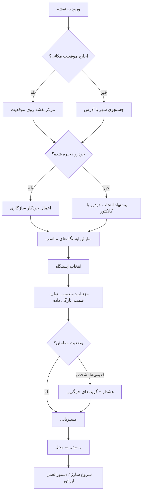
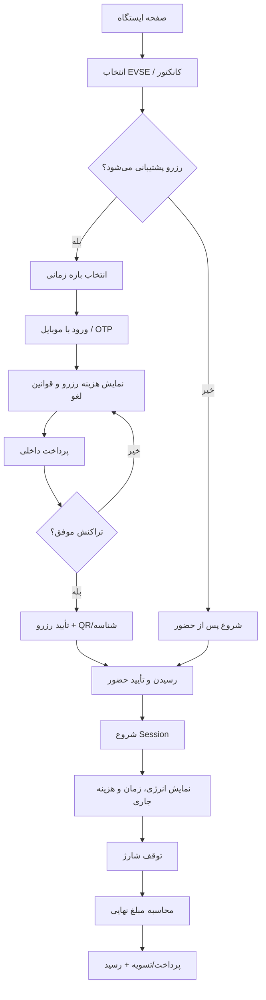
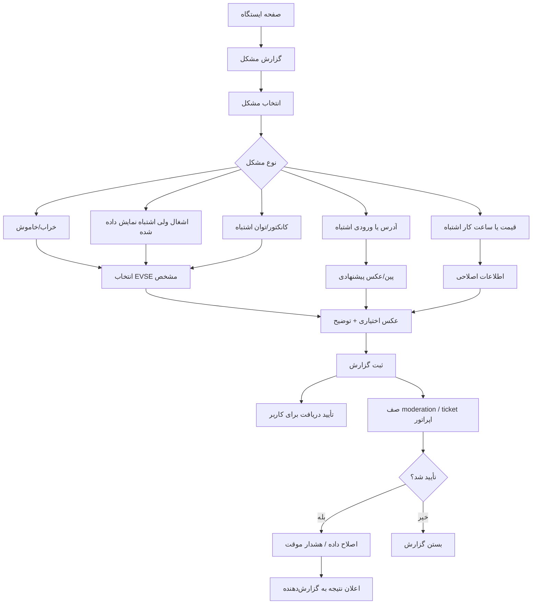
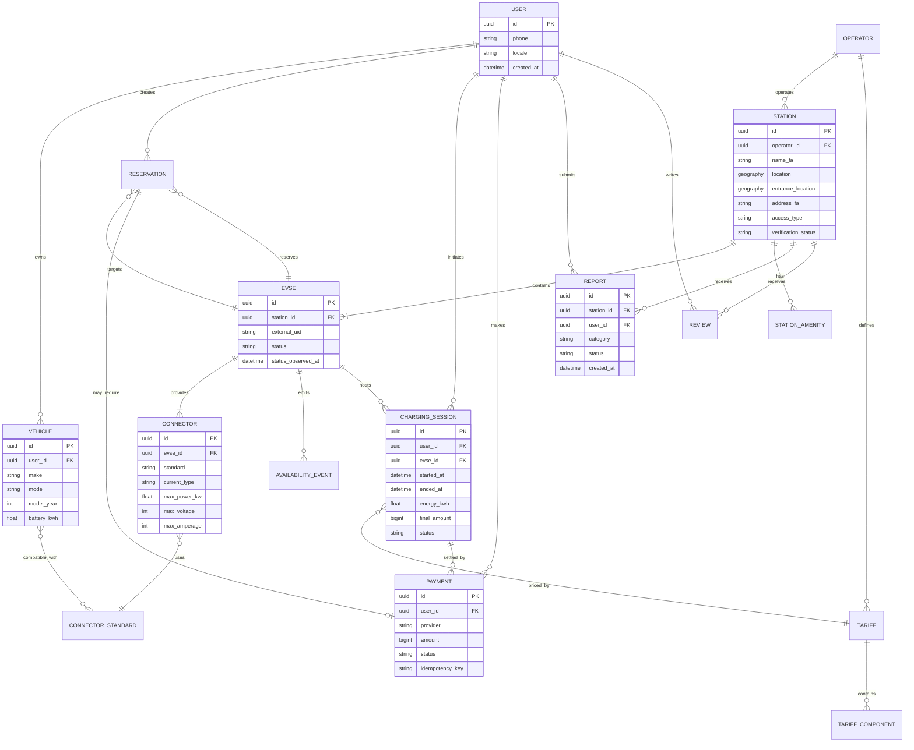
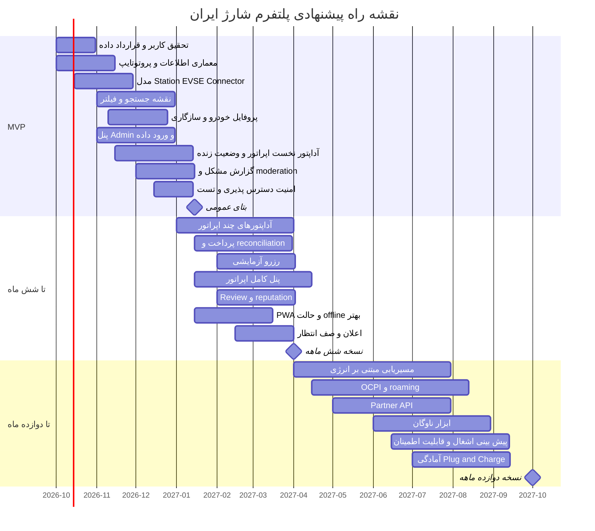

# مشخصات جامع محصول و تجربه کاربری برای وب‌سایت ایرانی ایستگاه‌های شارژ خودرو برقی

## خلاصه اجرایی

برای ایران، ساختن یک «نقشه پین‌های شارژر» کافی نیست. محصولی که واقعاً استفاده شود باید قبل از رسیدن راننده به ایستگاه به پنج سؤال با اطمینان پاسخ دهد: **آیا این شارژر با خودروی من سازگار است؟ آیا الان کار می‌کند؟ آیا آزاد است؟ هزینه‌اش چقدر است؟ و دقیقاً چطور وارد محل شوم و شارژ را شروع کنم؟** همین الگو در محصولات موفق جهانی دیده می‌شود: PlugShare روی داده اجتماعی، فیلتر سازگاری، امتیاز و check-in تکیه دارد؛ ChargePoint و Tesla وضعیت لحظه‌ای و شروع شارژ را به تجربه کاربر وصل می‌کنند؛ ABRP مسئله را از «پیدا کردن شارژر» به «برنامه‌ریزی انرژی سفر» ارتقا داده؛ و DEWA در دبی حتی برای مهمان، مسیر QR → پرداخت → شارژ → رسید را پوشش می‌دهد. citeturn0search0turn0search1turn0search13turn0search19turn11search1

**پیشنهاد محصول:** سایت ایرانی را به‌عنوان یک **لایه اعتماد و interoperability** میان راننده، اپراتور شارژ، نقشه، پرداخت و در آینده خودرو طراحی کنید. مزیت رقابتی اصلی نباید تعداد پین‌ها باشد؛ بلکه باید «کیفیت و تازگی داده»، «سازگاری دقیق با خودرو»، «قابلیت رسیدن و شروع موفق شارژ» و «پوشش چند اپراتور» باشد.

برای ایران این موضوع حساس‌تر است. نمونه‌های عمومی شبکه شارینت نشان می‌دهند که در یک ایستگاه ممکن است هم‌زمان کانکتورهای `CCS2` و `GB/T` وجود داشته باشند، و اطلاعیه‌های خود شبکه نیز موارد از‌دسترس‌خارج‌شدن ایستگاه‌ها یا اختلال ناشی از زیرساخت اینترنت را گزارش کرده‌اند. بنابراین نشان دادن صرف یک نشان سبز «ایستگاه موجود است» گمراه‌کننده است؛ محصول باید **وضعیت هر EVSE/کانکتور، زمان آخرین به‌روزرسانی و منبع داده** را نمایش دهد. citeturn13search11turn13search3turn13search5

برای نسخه MVP توصیه می‌شود دامنه محصول عمداً محدود اما بسیار قابل‌اعتماد باشد: نقشه و جست‌وجوی سریع، پروفایل خودرو و فیلتر سازگاری، صفحه کامل ایستگاه، مسیریابی یا تحویل مسیر به نشان/نقشه، وضعیت لحظه‌ای هرجا فید معتبر وجود دارد، اعلام واضح «نامشخص» هرجا وجود ندارد، گزارش خرابی و اصلاح اطلاعات، پنل مدیریت داده و ingestion اپراتورها. پرداخت و رزرو باید فقط برای اپراتورهایی فعال شود که API عملیاتی و توافق تجاری مطمئن دارند؛ نباید UI وعده‌ای بدهد که لایه عملیاتی قادر به انجام آن نیست.

درگاه پرداخت باید پشت یک abstraction مستقل قرار گیرد و برای بازار ایران با PSP/پرداخت‌یارهای متصل به اکوسیستم شاپرک کار کند؛ احراز هویت، callback امضاشده، idempotency، تطبیق مالی و رسید باید جزو طراحی پایه باشند. منابع پرداخت‌یارهای فعال نیز فعالیت در چهارچوب شاپرک/بانک مرکزی و احراز هویت پذیرندگان را تصریح می‌کنند. citeturn4search0turn4search1turn4search3

از منظر مقررات نیز زیرساخت در حال شکل‌گیری است: مقررات مربوط به خودروهای برقی، وزارت کشور/شهرداری‌ها و سازمان راهداری را با همکاری وزارت نیرو در بررسی محل ایستگاه‌های شارژ دخیل کرده‌اند؛ برنامه جامع حمل‌ونقل انرژی سال ۱۴۰۴ نیز از احداث شارژر توسط شهرداری‌ها، تخصیص فضا، مدل‌های مشارکت عمومی-خصوصی و تدوین الزامات فنی/ایمنی صحبت می‌کند. بنابراین سیستم داده و تعرفه باید **قابل نسخه‌بندی و قابل تغییر** باشد و قیمت برق یا قواعد مجوز را در کد hard-code نکند. citeturn16search1turn16search2turn16search0

تصویر هدف محصول:

> **نسخه اولیه:** «بهترین ایستگاه سازگار و قابل‌اعتماد نزدیک من کجاست؟»  
> **تا شش ماه:** «همین‌جا رزرو/پرداخت/شروع کنم و مطمئن باشم کار می‌کند.»  
> **تا دوازده ماه:** «مقصد را بگو؛ سامانه با توجه به خودرو، شارژ باتری و ایستگاه‌ها کل سفر را برایم برنامه‌ریزی کند.»

## کاربران هدف و واقعیت بازار ایران

### پرسوناهای کلیدی

| پرسونا | زمینه استفاده | هدف اصلی | نیازها | نقاط درد |
|---|---|---|---|---|
| **راننده شخصی شهری** | تهران، کرج، مشهد، اصفهان و شهرهای بزرگ؛ عمدتاً شارژ روزمره | پیدا کردن سریع شارژر نزدیک | فاصله/ETA، وضعیت آزاد، سازگاری، قیمت، ساعت کار، ورود به پارکینگ | رسیدن و دیدن شارژر خراب/اشغال؛ آدرس مبهم؛ ندانستن کانکتور |
| **مسافر بین‌شهری** | سفر با فاصله نزدیک به برد خودرو | اطمینان از رسیدن بدون اضطراب برد | برنامه سفر، توان واقعی شارژر، جایگزین بعدی، امکانات محل، ساعات فعالیت | فاصله زیاد بین گزینه‌ها؛ خرابی یک ایستگاه حیاتی؛ اینترنت ناپایدار؛ داده قدیمی |
| **راننده تاکسی/ناوگان پرکار** | زمان توقف مستقیماً هزینه اقتصادی دارد | کمینه‌کردن زمان انتظار و شارژ | وضعیت لحظه‌ای، صف/رزرو، توان بالا، صورتحساب، تاریخچه، انتخاب بر اساس زمان کل | صف، توان کمتر از انتظار، پرداخت پراکنده، نبود گزارش هزینه |
| **مالک تازه‌کار EV** | هنوز مفاهیم شارژ را نمی‌شناسد | بفهمد کجا و چگونه شارژ کند | توضیح ساده سازگاری، فیلتر خودکار با مدل خودرو، راهنمای قدم‌به‌قدم | سردرگمی بین `kW`، `kWh`، `CCS2`، `GB/T`، AC/DC و آداپتور |
| **اپراتور/مالک ایستگاه** | CPO، پارکینگ، مرکز تجاری، شهرداری یا سایت سازمانی | استفاده بیشتر و عملیات کم‌خطاتر | مدیریت وضعیت، تعرفه، EVSEها، خرابی، تراکنش و reconciliation | چند سازنده سخت‌افزار، داده ناسازگار، قطع ارتباط، پشتیبانی |
| **مدیر سامانه/تیم عملیات** | پلتفرم چنداپراتوری | حفظ اعتماد به داده | moderation، audit log، merge duplicate، مدیریت اپراتور و SLA | داده تکراری، گزارش‌های متناقض، feed stale، تقلب و spam |

طراحی برای «مالک تازه‌کار» اهمیت ویژه‌ای دارد: PlugShare امکان ذخیره خودرو و فیلتر کردن خودکار کانکتورهای سازگار را دارد و ABRP مدل انرژی را حتی بر اساس مدل خودرو وارد برنامه‌ریزی می‌کند. الگوی مناسب برای ایران این است که کاربر یک‌بار مدل خودرو را انتخاب کند و از آن پس **گزینه‌های ناسازگار به‌طور پیش‌فرض مخفی یا با هشدار جدی نمایش داده شوند**. citeturn0search1turn0search19

### مسائل اختصاصی ایران و راهکار پیشنهادی

| مسئله | اثر روی کاربر | راهکار طراحی/فنی |
|---|---|---|
| **ناهمگونی کانکتورها و خودروهای وارداتی** | «شارژر هست ولی به ماشین من نمی‌خورد» | دیتابیس مدل خودرو + استاندارد ورودی؛ سازگاری در سطح Connector، نه Station؛ نمایش صریح `CCS2`، `GB/T DC/AC`، `Type 2` و سایر موارد واقعی |
| **وضعیت عملیاتی نامطمئن** | سفر بی‌نتیجه به ایستگاه | telemetry اپراتور + گزارش کاربران + `last updated` + وضعیت `UNKNOWN` برای داده کهنه |
| **اختلال اینترنت/ارتباط شارژر** | وضعیت آنلاین قدیمی یا عدم شروع جلسه | PWA، cache اطلاعات ثابت، صف محلی گزارش‌ها، fallback عملیات اپراتور؛ هرگز داده cache‌شده را «آنلاین» نشان ندهید |
| **آدرس و ورودی پیچیده ایستگاه** | کاربر به مجتمع می‌رسد ولی شارژر را پیدا نمی‌کند | pin جداگانه «ورودی»، عکس محل، طبقه پارکینگ، landmark فارسی، مختصات شارژر و entrance به‌صورت جدا |
| **پرداخت داخلی** | تجربه بین‌المللی کارت/Wallet قابل کپی مستقیم نیست | abstraction پرداخت، IPG داخلی/پرداخت‌یار، کیف پول اختیاری، QR و reconciliation |
| **تعرفه‌ها و قواعد متغیر** | قیمت نهایی غیرقابل‌پیش‌بینی | tariff engine با `valid_from/valid_to`، قیمت اپراتور، breakdown و زمان آخرین تأیید |
| **زبان RTL با اصطلاحات لاتین** | بی‌نظمی بصری در `CCS2`, `kW`, کدها | RTL واقعی + bidi isolation برای قطعات LTR |
| **پراکندگی منابع اطلاعاتی** | کاربر نمی‌داند به کدام منبع اعتماد کند | provenance؛ برای هر فیلد مشخص باشد «اپراتور / telemetry / مدیر / کاربر» و چه زمانی تأیید شده |

وجود `CCS2` و `GB/T` در اطلاعات یک ایستگاه واقعی شارینت نشان می‌دهد فیلتر استاندارد کانکتور در ایران یک feature جانبی نیست، بلکه جزو هسته محصول است. همچنین اطلاعیه‌های خود شارینت درباره اختلال سرویس ناشی از زیرساخت ارتباطی، نیاز به حالت degraded/offline و نمایش freshness را تقویت می‌کند. citeturn13search11turn13search3

برای نقشه، وابسته‌کردن محصول به یک provider نیز ریسک‌آفرین است. پلتفرم نقشه نشان API/SDK برای سرویس‌های نقشه و مکان ارائه می‌کند؛ در مقابل داده OpenStreetMap تحت ODbL قابل استفاده است، اما سرور عمومی `tile.openstreetmap.org` برای bulk/offline و سرویس production بدون SLA طراحی نشده است. بنابراین لایه نقشه باید provider-agnostic باشد: **نشان یا provider محلی برای geocoding/routing + داده OSM/tiles خودمیزبان یا provider تجاری به‌عنوان گزینه resilience**. citeturn8search2turn8search7turn7search1turn7search0

## دامنه محصول و اولویت‌بندی قابلیت‌ها

### اصل طراحی محصول

هر نتیجه ایستگاه باید به‌جای «نام + فاصله»، یک **تصمیم قابل اقدام** بسازد:

**سازگار است؟ → الان قابل استفاده است؟ → چقدر طول می‌کشد برسم؟ → چه سرعتی می‌گیرم؟ → چقدر می‌پردازم؟ → اگر خراب بود گزینه بعدی چیست؟**

اطلاعات ایستگاه بهتر است در سلسله‌مراتب استاندارد زیر نگهداری شود:

`Location/Station → EVSE → Connector`

به این ترتیب «ایستگاه سه شارژر دارد» با «سه سوکت روی یک دستگاه» اشتباه نمی‌شود و وضعیت `AVAILABLE/OCCUPIED/RESERVED/OUT_OF_SERVICE` می‌تواند در سطح صحیح اعمال شود. این ساختار همچنین با مدل‌های رایج interoperability مانند OCPI هم‌راستاست؛ OCPI برای تبادل location، وضعیت، تعرفه، session و CDR میان CPO و eMSP طراحی شده است. citeturn9search25turn9search0

### ماتریس قابلیت‌ها

| قابلیت | MVP | تا ۶ ماه | تا ۱۲ ماه | توضیح |
|---|:---:|:---:|:---:|---|
| نقشه تعاملی + geolocation | ● | تکمیل | تکمیل | محور اصلی کشف |
| جست‌وجوی نام/شهر/آدرس | ● | بهبود relevance | semantic | فارسی، املای جایگزین |
| فیلتر کانکتور | ● | ● | ● | حیاتی |
| پروفایل خودرو و compatibility | ● | چند خودرو | داده live خودرو | باید friction را کم کند |
| فیلتر توان، فاصله، ساعت کار | ● | ● | ● | Quick filters |
| وضعیت لحظه‌ای | **● هرجا feed موجود است** | پوشش بیشتر | roaming | در غیر این صورت «نامشخص» |
| زمان آخرین به‌روزرسانی | ● | ● | ● | شاخص اعتماد |
| صفحه جزئیات و عکس ورودی | ● | richer POI | ● | last-mile |
| تحویل مسیر به نشان/نقشه | ● | ● | ● | کم‌ریسک‌ترین MVP |
| مسیریابی داخلی معمولی | اختیاری | ● | ● | قبل از energy routing |
| گزارش خرابی/اطلاعات غلط | ● | workflow اپراتور | reputation | داده اجتماعی سبک |
| امتیاز و review | check-in سبک | ● | reputation weighting | moderation لازم |
| اعلان بازشدن پورت | — | ● | ● | بسیار مفید در شهر |
| پرداخت آنلاین | فقط integration آماده | ● | roaming | feature پیچیده |
| شروع/توقف شارژ | —/integration محدود | ● | چنداپراتوری | نیازمند CPO API |
| رزرو | — | pilot | ● | فقط با enforcement واقعی |
| تاریخچه و رسید | در صورت پرداخت | ● | ● | مالی/ناوگان |
| Operator Dashboard | import ساده | ● | analytics پیشرفته | B2B |
| Admin Console | ● | ● | ● | از روز اول |
| API عمومی read-only | — | محدود | ● | rate limit/OAuth |
| OCPI roaming | — | prototype | ● | interoperability |
| برنامه‌ریز سفر مبتنی بر انرژی | — | prototype | ● | مانند ABRP |
| ناوگان و گزارش تجمیعی | — | — | ● | B2B |
| پیش‌بینی صف/اشغال | — | داده‌برداری | آزمایشی | فقط پس از دیتای کافی |

**رزرو را عمداً از MVP حذف کنید.** رزرو وقتی ارزشمند است که اپراتور بتواند آن EVSE را واقعاً برای کاربر نگه دارد، no-show را مدیریت کند و وضعیت رزرو در خود charger/CSMS enforce شود. OCPP 2.0.1 ماژول اختیاری reservation دارد، اما وجود پروتکل به‌تنهایی تضمین نمی‌کند تمام سخت‌افزارهای موجود این رفتار را درست پیاده کنند. citeturn1search2

### جست‌وجو و رتبه‌بندی نتایج

«نزدیک‌ترین» نباید همیشه اولین نتیجه باشد. پیشنهاد می‌شود یک score داخلی از این عوامل ساخته شود:

`Compatibility × OperationalConfidence × Availability × Detour × Power × Reliability × Price`

وزن دقیق باید A/B test شود. منطق پایه:

- ناسازگار با خودرو → حذف پیش‌فرض.
- `OUT_OF_SERVICE` → پایین یا مخفی.
- وضعیت قدیمی → confidence penalty.
- برای سفر بین‌شهری → قابلیت اطمینان و وجود ایستگاه جایگزین از قیمت مهم‌تر.
- برای تاکسی → ETA + زمان انتظار + زمان شارژ غالب شود.
- برای کاربر بدون پروفایل خودرو → نتیجه بدون ادعای «سازگار» نمایش داده شود.

### پنل اپراتور و مدیریت

پنل اپراتور باید امکان مشاهده سایت‌ها، EVSEها، وضعیت اتصال، تعرفه جاری، sessionها، خرابی‌ها، گزارش کاربران، uptime و reconciliation پرداخت را بدهد. در MVP بهتر است یک **modular monolith** با RBAC روشن ساخته شود نه چند microservice زودهنگام؛ جداسازی سرویس‌ها زمانی ارزش دارد که throughput یا ownership سازمانی آن را توجیه کند.

Admin Console باید حداقل duplicate detection، merge station، تأیید مختصات، مدیریت عکس‌ها، moderation review/report، تعلیق اپراتور، override موقت با audit trail و مشاهده سلامت feedها را پشتیبانی کند.

اصل مهم: **ویرایش دستی نباید telemetry را بی‌صدا overwrite کند.** هر فیلد یک source، timestamp و priority داشته باشد.

## تجربه کاربری، معماری اطلاعات و رابط

### معماری اطلاعات پیشنهادی

در موبایل/PWA:

`نقشه | مسیر | فعالیت من | حساب`

و در صفحه نقشه:

`جست‌وجو → فیلتر سریع → نتایج نقشه/لیست → جزئیات ایستگاه → اقدام`

«فعالیت من» شامل رزروها، sessionها، پرداخت‌ها، گزارش‌ها و bookmarkها می‌شود. «مسیر» برای trip planning جدا باشد؛ ترکیب‌کردن search محلی و route planner پیشرفته در یک صفحه، مخصوصاً برای کاربر تازه‌کار، cognitive load را بالا می‌برد.

نسخه دسکتاپ می‌تواند از layout سه‌ستونه استفاده کند:

`فیلتر | لیست نتایج | نقشه`

اما در موبایل بهتر است map + draggable bottom sheet الگوی اصلی باشد.

### جریان پیدا کردن ایستگاه



این مدل از نقاط قوت PlugShare الهام می‌گیرد: vehicle profile، فیلتر کانکتور، عکس و اطلاعات last-mile، check-in و گزارش کاربران از اجزای اصلی تجربه آن هستند. citeturn0search1turn0search3

### جریان رزرو، پرداخت و شروع



DEWA نمونه مفیدی از کم‌کردن friction است: مهمان می‌تواند با QR یا انتخاب شارژر نزدیک، تأیید، پرداخت و سپس پایش session را انجام دهد؛ کاربران ثبت‌شده نیز history و وضعیت شارژ را در اختیار دارند. برای ایران «guest-like flow» ارزشمند است، ولی پرداخت و احراز باید مطابق ابزارهای داخلی پیاده شود. citeturn11search1turn11search2

### جریان گزارش مشکل



### ماکاپ نقشه و جست‌وجو

```text
┌──────────────────────────────────────────────┐
│ ☰   🔍  جستجوی شهر، خیابان یا ایستگاه       │  [1]
│                                              │
│  خودروی من: BYD ... ▾     ◎ موقعیت من       │  [2]
│                                              │
│ [سازگار] [آزاد الآن] [≥60kW] [قیمت] [بیشتر]│  [3]
├──────────────────────────────────────────────┤
│                                              │
│            ○ 2                               │
│       🟢                 🟠                  │
│                   ▲ من                       │  [4]
│                           ⚪                  │
│       🟢                                     │
│                                              │
├──────────────────────────────────────────────┤
│  نزدیک‌ترین گزینه قابل‌اعتماد               │
│  شارژر ...                      ۸ دقیقه      │
│  ● 2/3 آزاد • CCS2 • 120 kW                 │  [5]
│  بروزرسانی ۳۸ ثانیه پیش • داده اپراتور      │  [6]
│                                              │
│ [جزئیات]                    [مسیریابی ←]     │
└──────────────────────────────────────────────┘
```

**حاشیه‌نویسی:** `[1]` جست‌وجو همیشه در دسترس؛ `[2]` خودرو context دائمی سازگاری است؛ `[3]` حداکثر چند quick filter، نه ۲۰ گزینه؛ `[4]` رنگ هرگز تنها حامل وضعیت نباشد و icon/label نیز وجود داشته باشد؛ `[5]` «آزاد/کل» در سطح EVSE؛ `[6]` freshness و source مستقیماً دیده شود.

پین خاکستری باید صریحاً به‌معنی **«وضعیت آنلاین نامشخص»** باشد، نه «خراب». این تفاوت برای جلوگیری از بی‌اعتمادی حیاتی است.

### ماکاپ صفحه ایستگاه

```text
┌──────────────────────────────────────────────┐
│ ←  ایستگاه شارژ آزادی                 ☆     │
│                                              │
│ ● قابل استفاده الآن                          │
│ 3 از 4 پورت آزاد                            │  [1]
│ داده اپراتور • بروزرسانی ۴۵ ثانیه پیش       │  [2]
├──────────────────────────────────────────────┤
│ سازگاری با خودروی شما:  ✓ سازگار            │  [3]
│                                              │
│ CCS2       120 kW       ● آزاد       01      │
│ CCS2       120 kW       ● آزاد       02      │
│ GB/T DC     60 kW       ● اشغال      03      │
│ GB/T AC      7 kW       ⚠ نامشخص     04      │
├──────────────────────────────────────────────┤
│ قیمت                                         │
│ انرژی: ... تومان / kWh                       │
│ توقف اضافی: ...                              │  [4]
│                                              │
│ ساعت فعالیت: ۲۴ ساعته                       │
│ ورودی: ضلع شرقی پارکینگ، طبقه همکف          │
│ [📷 عکس ورودی]   [📍 مشاهده ورودی]           │  [5]
│                                              │
│ امکانات: سرویس │ فروشگاه │ روشنایی          │
├──────────────────────────────────────────────┤
│ [مسیریابی]        [رزرو]       [شروع شارژ]  │  [6]
│                                              │
│ ⚠ گزارش خرابی یا اطلاعات اشتباه             │
└──────────────────────────────────────────────┘
```

مهم‌ترین تغییر نسبت به directoryهای معمولی در `[1]–[3]` است: کاربر باید **قبل از قیمت و review** بفهمد آیا واقعاً می‌تواند شارژ کند. `[5]` نیز last-mile navigation را حل می‌کند؛ PlugShare به همین دلیل عکس‌ها و جزئیات محل را بخشی از تجربه یافتن charger قرار داده است. citeturn0search1

### ماکاپ رزرو و پرداخت

```text
┌──────────────────────────────────────────────┐
│ ← رزرو شارژ                                  │
├──────────────────────────────────────────────┤
│ ایستگاه آزادی                               │
│ CCS2 • 120 kW • EVSE 02                     │
│                                              │
│ زمان                                         │
│ [امروز  ۱۸:۳۰ — ۱۹:۰۰          ▾]           │
│                                              │
│ هزینه رزرو                    XX,XXX تومان   │  [1]
│ هزینه شارژ            بر اساس مصرف واقعی    │  [2]
│ هزینه توقف پس از پایان          ...          │
│                                              │
│ ┌──────────────────────────────────────────┐ │
│ │ مجموع قابل پرداخت الآن       XX,XXX     │ │
│ └──────────────────────────────────────────┘ │
│                                              │
│ روش پرداخت                                  │
│ ◉ درگاه بانکی                              │
│ ○ کیف پول                                  │  [3]
│                                              │
│ ☐ قوانین لغو و no-show را می‌پذیرم          │  [4]
│                                              │
│           [ تأیید و پرداخت ]                │
│                                              │
│ رزرو تا ۵ دقیقه هنگام پرداخت نگه داشته می‌شود│ [5]
└──────────────────────────────────────────────┘
```

مبلغ رزرو و مبلغ نهایی انرژی را نباید با هم مخلوط کرد. اگر مصرف واقعی تا پایان session مشخص نیست، UI باید دقیقاً همین را بگوید. Chargemap نیز قیمت شبکه و هزینه‌های سرویس را از هم قابل تشخیص می‌کند؛ شفافیت قیمت بهتر از نمایش یک «عدد تخمینی زیبا ولی غیرقابل اتکا» است. citeturn1search29

### ماکاپ گزارش خرابی

```text
┌──────────────────────────────────────────────┐
│ ← گزارش مشکل                                 │
├──────────────────────────────────────────────┤
│ کجا؟  ایستگاه آزادی • EVSE 02               │
│                                              │
│ چه مشکلی وجود دارد؟                          │
│ ◉ شارژر روشن نمی‌شود                        │
│ ○ کانکتور آسیب دیده                         │
│ ○ وضعیت آزاد/اشغال اشتباه است               │
│ ○ آدرس یا محل اشتباه است                    │
│ ○ قیمت/ساعت کار اشتباه است                  │
│ ○ مورد دیگر                                 │
│                                              │
│ [ + افزودن عکس ]                             │
│                                              │
│ توضیح اختیاری                               │
│ ┌──────────────────────────────────────────┐ │
│ │                                          │ │
│ └──────────────────────────────────────────┘ │
│                                              │
│ [ ارسال گزارش ]                             │
│                                              │
│ بدون اینترنت؟ گزارش ذخیره و بعداً ارسال شود │
└──────────────────────────────────────────────┘
```

### دسترس‌پذیری و فارسی RTL

هدف عملی باید **WCAG 2.2 سطح AA** باشد. W3C توصیه می‌کند جهت سند RTL در خود HTML با `dir="rtl"` مشخص شود و برای عربی/فارسی نیز ملاحظات layout و bidi به‌صورت مستقل مستند شده‌اند. citeturn12search2turn12search5turn12search10

موارد مهم:

- کل رابط فارسی RTL باشد، اما مقادیر `CCS2`، `GB/T`، `kW`، URL، شناسه EVSE و اعداد فنی در span با جهت LTR/bidi isolation قرار گیرند.
- برای وضعیت فقط رنگ استفاده نشود: `● آزاد`، `■ اشغال`، `⚠ نامشخص` همراه با label.
- targetهای لمسی در استفاده کنار خودرو/فضای باز سخاوتمندانه طراحی شوند؛ حدود `44×44 CSS px` هدف مناسبی برای CTAهای اصلی است. W3C نیز target-size enhanced را در همین مقیاس مطرح می‌کند. citeturn12search22
- فونت فارسی باید ارقام، نقطه اعشار، slash و لاتین را بدون پرش baseline نشان دهد.
- تاریخ به‌شکل شمسی برای کاربر، اما timestamp سرور در UTC/ISO 8601 ذخیره شود.
- واحد انرژی `kWh` و توان `kW` هرگز با هم اشتباه نشوند؛ tooltip ساده برای تازه‌کارها اضافه شود.
- نام رسمی برندها و استانداردها transliterate نشوند؛ «CCS2» از «سی‌سی‌اس دو» قابل‌تشخیص‌تر است.
- screen reader باید وضعیت پین‌ها و تغییر real-time را بدون flood کردن live-region اعلام کند.
- motion نقشه قابل کاهش باشد و focus keyboard در desktop حفظ شود.

از نظر performance، هدف production در صدک ۷۵ باید حدود `LCP ≤ 2.5s`، `INP ≤ 200ms` و `CLS ≤ 0.1` باشد؛ این‌ها آستانه‌های توصیه‌شده Core Web Vitals هستند. citeturn14search25

برای رسیدن به آن: map JavaScript پس از shell اصلی lazy-load شود، markerها cluster شوند، تصاویر ورودی WebP/AVIF و responsive باشند، اطلاعات viewport با bounding box گرفته شود، payload وضعیت real-time incremental باشد و نه reload کل dataset.

## معماری فنی، داده، پرداخت، امنیت و API

### معماری پیشنهادی

```text
┌──────────────────── Clients ────────────────────┐
│ PWA/Web │ Mobile Web │ Operator │ Admin │ API  │
└───────────────────────┬─────────────────────────┘
                        │ HTTPS
                ┌───────▼────────┐
                │ API Gateway/BFF│
                │ Auth/Rate Limit│
                └───────┬────────┘
                        │
        ┌───────────────┼────────────────┐
        │               │                │
┌───────▼─────┐ ┌───────▼─────┐ ┌────────▼────────┐
│Station/Data │ │Session/Book. │ │ Payment/Billing │
│Search/Geo   │ │Charge Ops    │ │ Reconciliation │
└───────┬─────┘ └───────┬─────┘ └────────┬────────┘
        │               │                 │
        └───────┬───────┴────────┬────────┘
                │                │
       ┌────────▼───────┐   ┌────▼─────────┐
       │ PostgreSQL +   │   │ Redis / Queue│
       │ PostGIS        │   │ Event Stream │
       └────────────────┘   └────┬─────────┘
                                 │
             ┌───────────────────┼────────────────────┐
             │                   │                    │
       ┌─────▼─────┐       ┌─────▼──────┐      ┌─────▼─────┐
       │OCPP/CSMS  │       │OCPI/CPO API│      │CSV/Admin  │
       │ adapters  │       │ adapters   │      │Community  │
       └───────────┘       └────────────┘      └───────────┘
```

PostgreSQL + PostGIS برای MVP انتخاب منطقی است چون داده تراکنشی و مکانی در یک منبع canonical باقی می‌ماند. Redis برای cache، rate limiting و state موقت مناسب است؛ event queue برای feedها، callbackهای پرداخت و status eventها جلوی coupling شدید را می‌گیرد.

وب‌کلاینت وضعیت‌ها را از SSE یا WebSocket دریافت کند؛ polling کوتاه‌مدت برای صدها هزار کاربر هم هزینه بیشتری دارد و هم latency/traffic غیرضروری ایجاد می‌کند.

### منبع داده و سلسله‌مراتب اعتماد

پیشنهاد اولویت:

`Telemetry مستقیم charger/CPO > API رسمی اپراتور > پنل اپراتور > مدیر تأییدشده > گزارش جامعه > منبع ثالث`

هر رکورد مهم باید این metadata را داشته باشد:

```json
{
  "value": "AVAILABLE",
  "source": "operator_telemetry",
  "source_id": "cpo_17",
  "observed_at": "2026-09-26T12:30:04Z",
  "received_at": "2026-09-26T12:30:05Z",
  "confidence": 0.98
}
```

`confidence` بهتر است internal باشد و UI آن را به عبارات قابل‌فهم تبدیل کند:

- «وضعیت آنلاین — همین الآن»
- «آخرین گزارش ۸ دقیقه پیش»
- «وضعیت تأیید نشده»
- «گزارش کاربران: احتمال خرابی»

Threshold freshness را برای همه اپراتورها یکسان hard-code نکنید؛ chargerهای مختلف heartbeat متفاوت دارند. SLA هر feed باید configuration داشته باشد و پس از چند برابر شدن heartbeat مورد انتظار، وضعیت از «زنده» به «قدیمی» و سپس `UNKNOWN` تبدیل شود.

### OCPP، OCPI و استانداردها

OCPP برای ارتباط **شارژر ↔ CSMS** است. Open Charge Alliance همچنان OCPP 1.6 را پشتیبانی می‌کند، OCPP 2.0.1 قابلیت‌هایی مانند مدل دستگاه، امنیت قوی‌تر و integration با ISO 15118 را گسترش داده و OCPP 2.1 نیز در ۲۰۲۵ منتشر شده است. پس connector اپراتورها باید versioned باشد و فرض نکند همه تجهیزات ایران یک نسخه واحد دارند. citeturn1search5turn1search3

OCPI مسئله دیگری را حل می‌کند: **CPO ↔ eMSP/roaming platform** و تبادل location، availability، tariff، session و billing. مخزن رسمی OCPI نسخه 2.3.0 را نیز منتشر کرده است؛ در عمل بهتر است adapter چندنسخه‌ای داشته باشید و نسخه مورد استفاده را بر اساس شریک تجاری تعیین کنید، نه اینکه کل backend را به یک نسخه وابسته کنید. citeturn9search0turn9search25

ISO 15118 را برای MVP الزام نکنید، اما data model و معماری هویت نباید Plug & Charge آینده را غیرممکن کند؛ ISO 15118 خانواده ارتباط EV و EVSE را تعریف می‌کند و در اکوسیستم CCS برای interoperable charging اهمیت دارد. citeturn9search9turn9search41

### مدل داده پیشنهادی



دو نکته مدل داده بسیار مهم‌اند:

اول، `Station.status` نباید تنها منبع truth باشد؛ status ایستگاه از EVSEهای آن **محاسبه** می‌شود. ممکن است یک پورت خراب و دو پورت آزاد باشند.

دوم، قیمت باید component-based باشد تا مدل‌های `per kWh`، زمان، session fee، parking/idle fee و ترکیب آن‌ها را بتوان بدون schema migration پشتیبانی کرد.

### API پیشنهادی

API عمومی را REST ساده و versioned نگه دارید:

```http
GET /v1/stations?bbox=...&connector=CCS2&min_power_kw=60&status=AVAILABLE
GET /v1/stations/{station_id}
GET /v1/stations/{station_id}/evses
GET /v1/stations/{station_id}/reviews

GET /v1/vehicles/models?query=...
POST /v1/routes/charging-plan

POST /v1/reports
POST /v1/reservations
DELETE /v1/reservations/{id}

POST /v1/payment-intents
GET /v1/payments/{id}

POST /v1/charging-sessions
GET /v1/charging-sessions/{id}
POST /v1/charging-sessions/{id}/stop
```

برای operator:

```http
GET   /v1/operator/stations
PATCH /v1/operator/stations/{id}
POST  /v1/operator/status-events
POST  /v1/operator/tariffs
GET   /v1/operator/sessions
GET   /v1/operator/reconciliation
```

اصول قرارداد API:

- cursor pagination، نه offset در dataset بزرگ؛
- `ETag` و conditional request برای داده ایستگاه؛
- `Idempotency-Key` برای پرداخت، رزرو و شروع session؛
- OAuth2/OIDC برای partner API؛
- scopes مانند `stations:read`, `sessions:read`, `sessions:control`;
- webhook امضاشده؛
- schema versioning؛
- timestamps همیشه timezone-aware؛
- `429` + `Retry-After` برای rate limit؛
- شناسه داخلی هرگز به شناسه اپراتور وابسته نشود.

PlugShare نیز Charging Stations API تجاری ارائه می‌دهد و داده خود را برای head unit، اپ‌های برندشده و analytics license می‌کند؛ این نشان می‌دهد API می‌تواند بعداً هم قابلیت product و هم کانال B2B باشد. citeturn14search11turn14search18

### پرداخت برای ایران

لایه پرداخت را به شکل زیر جدا کنید:

```text
Reservation / Session
        │
        ▼
 Payment Orchestrator
        │
 ┌──────┼────────┐
 ▼      ▼        ▼
PSP A  PSP B   Wallet
        │
        ▼
Webhook + Reconciliation
```

در backend اطلاعات کارت بانکی ذخیره نشود؛ کاربر به صفحه PSP/پرداخت‌یار منتقل شود، callback فقط پس از verification server-to-server معتبر تلقی شود و هر پرداخت idempotency key داشته باشد. منابع پرداخت‌یارهای ایرانی فعالیت در شبکه شاپرک، الزامات احراز هویت و نظارت این اکوسیستم را صریحاً مطرح می‌کنند. citeturn4search0turn4search1

برای sessionهایی که مبلغ نهایی از قبل معلوم نیست، از فرض «pre-authorisation کارت» خودداری کنید مگر PSP منتخب چنین قابلیت قراردادی داشته باشد. سه مدل عملی قابل بررسی است:

1. کیف پول با موجودی کافی و کسر نهایی؛
2. پیش‌پرداخت سقف + تسویه/بازگشت مابه‌التفاوت؛
3. شروع مجاز برای حساب تأییدشده و پرداخت مبلغ نهایی پس از session.

انتخاب میان آن‌ها باید با PSP، اپراتور و مشاور حقوقی/مالی validate شود.

### امنیت و حریم خصوصی

OCPP infrastructure باید مانند یک سیستم عملیاتی جدی محافظت شود؛ Open Charge Alliance نیز برای OCPP راهنمای امنیت عملیات منتشر کرده است. citeturn1search1

حداقل کنترل‌ها:

| حوزه | الزام |
|---|---|
| حساب کاربر | OTP با rate limit؛ session rotation؛ device/risk signals |
| اپراتور | MFA؛ RBAC؛ در صورت امکان SSO |
| API | OAuth scopes، API keys مجزا، throttling، schema validation |
| شبکه | TLS، HSTS، WAF، جداسازی endpointهای charger |
| OCPP | certificate management، rotation و security profile متناسب با دستگاه |
| Secret | secret manager؛ هیچ credential در source code |
| Payment | عدم نگهداری PAN، verify server-side، webhook signature، reconciliation |
| Admin | MFA اجباری، audit log تغییرات، privileged-action logging |
| داده مکانی | opt-in؛ نگهداری حداقلی history؛ حذف داده غیرضروری |
| فایل/عکس | malware scanning و metadata stripping |
| عملیات | backup تست‌شده، incident response، observability و alerting |

قانون تجارت الکترونیکی ایران برای داده‌های شخصی اصولی از جمله هدف مشخص، رضایت در موارد مقرر، تناسب گردآوری، امکان دسترسی/اصلاح و محدودیت‌هایی برای داده‌های حساس در نظر گرفته است؛ بنابراین privacy-by-design و data minimisation نباید به مرحله بعد موکول شود. citeturn3search2

به‌خصوص **مسیرهای کامل رفت‌وآمد کاربر را صرفاً چون GPS در دسترس است ذخیره نکنید**. برای «نزدیک من» مختصات می‌تواند در request استفاده و سپس دور انداخته شود، مگر کاربر صریحاً trip history را فعال کرده باشد.

### الزامات حقوقی و مقرراتی

در ایران، مقررات ۱۴۰۳ نقش وزارت کشور/شهرداری و وزارت راه/راهداری را در بررسی مکان‌های پیشنهادی ایستگاه با همکاری وزارت نیرو مشخص کرده و تدوین دستورالعمل تأمین برق ایستگاه‌ها را نیز به وزارت نیرو سپرده است. برنامه ۱۴۰۴ حمل‌ونقل انرژی نیز احداث ایستگاه، واگذاری فضا و مدل PPP را وارد سیاست اجرایی کرده است. citeturn16search1turn16search2turn16search0

بنابراین پیش از launch تجاری پرداخت/شارژ، بررسی حقوقی باید حداقل این موارد را پوشش دهد: شرایط استفاده، مسئولیت پلتفرم در برابر CPO، نمایش قیمت و مالیات/کارمزد، شرایط رزرو و refund، retention داده، قرارداد پردازش داده اپراتور، مجوزهای مربوط به پرداخت و هر الزام استانی/شهری مرتبط با ایستگاه.

**تعرفه برق را به‌عنوان یک ثابت قانونی در specification ننویسید.** قواعد تعرفه و دستورالعمل‌های مربوط می‌توانند تغییر کنند؛ سامانه باید tariff configuration با تاریخ شروع/پایان، source document و approval state داشته باشد.

## تحلیل رقابتی و الگوهای قابل اقتباس

پنج نمونه بین‌المللی مناسب برای benchmark عبارت‌اند از PlugShare، ChargePoint، Tesla Supercharger، ABRP و Chargemap. برای قیاس منطقه‌ای/ایرانی، سه analogue مفید Sharinet/MAPNA، IranEV و DEWA هستند. این‌ها کاملاً هم‌رده نیستند: برخی directory/community، برخی CPO، برخی trip planner و برخی utility هستند؛ همین تفاوت برای تصمیم‌گیری محصول مفید است.

| محصول | نقشه/کشف | Live status | Routing | پرداخت/شروع | رزرو | Community | مدل/تمرکز تجاری |
|---|---|---|---|---|---|---|---|
| **PlugShare** | قوی | در شبکه‌های پشتیبانی‌شده | Trip Planner | Pay در برخی شبکه‌ها | محدود/وابسته | **بسیار قوی** | اپ رایگان راننده + تبلیغات و API تجاری citeturn0search0turn0search1turn14search18 |
| **ChargePoint** | قوی | **قوی** | بله | **شروع و پرداخت** | بله/Waitlist در محصولات شبکه | محدودتر | سخت‌افزار + نرم‌افزار/Cloud و خدمات B2B اشتراکی citeturn0search40turn0search41turn14search0turn14search7 |
| **Tesla Supercharger** | اکوسیستم یکپارچه | **قوی** | **Trip Planner یکپارچه خودرو** | یکپارچه با حساب | waitlist در برخی تجربه‌ها | کم | شبکه شارژ عمودی متصل به اکوسیستم خودرو citeturn0search13turn0search16turn0search29 |
| **ABRP** | مبتنی بر route | real-time در integrationها | **نقطه قوت اصلی** | محور اصلی نیست | — | محدود | Freemium/Premium + API/partner citeturn0search19turn0search27turn0search31 |
| **Chargemap** | قوی | وابسته به شبکه | **قوی** | Chargemap Pass / برخی smartphone flows | شبکه‌محور | review/community | Pass + service fee + subscription Boost citeturn1search23turn1search25turn1search29turn1search21 |
| **Sharinet / MAPNA** | بله | پایش شبکه وجود دارد | routing | عملیات شارژ در اکوسیستم | رزرو به‌عنوان قابلیت اعلام‌شده | محدود | شبکه/پلتفرم عملیات شارژ؛ جزئیات عمومی مدل درآمد محدود است citeturn10search6turn10search7turn10search12 |
| **IranEV** | **directory/map** | شواهد عمومی روشن نیست | تحویل به نقشه‌های بیرونی | شواهد روشن نیست | — | محتوایی | directory/media؛ مدل درآمد عمومی شفاف نیست citeturn2search9 |
| **DEWA EV Green Charger** | بله | **availability** | مکان‌یابی | **QR/guest/payment** | تمرکز اصلی نیست | — | سرویس utility/public charging و پرداخت مصرف citeturn11search1turn11search2turn11search11 |

### درس‌هایی که باید کپی شوند — و چیزهایی که نباید

**از PlugShare:** لایه اعتماد اجتماعی را بگیرید، نه شلوغی احتمالی اطلاعات را. PlugScore، check-in، عکس و گزارش خرابی در محیطی که فیدهای اپراتوری هنوز کامل نیستند بسیار ارزشمند است. PlugShare حتی review/check-in را برای نشان‌دادن کیفیت و شرایط واقعی به کار می‌گیرد. citeturn0search1

**از ChargePoint:** status → start → payment → history را یک زنجیره ببینید. ChargePoint علاوه بر realtime، نرم‌افزار شبکه، قیمت‌گذاری و جمع‌آوری وجه را به محصول B2B متصل می‌کند؛ این الگو برای پنل CPO ایرانی مناسب‌تر از ساختن صرف یک consumer app است. citeturn14search0turn14search3

**از Tesla:** trip planning را به energy planning تبدیل کنید. Tesla برنامه توقف در Supercharger را در خود سفر وارد می‌کند؛ مزیت تجربه در این است که راننده مجبور نیست خودش ترکیب SOC، فاصله و شارژرها را محاسبه کند. citeturn0search13

**از ABRP:** داده مدل خودرو و مصرف را asset محصول بدانید. ABRP بیش از هزار مدل داده‌محور خودرو را پشتیبانی می‌کند و API آن مدل‌سازی مصرف، optimisation شارژ، ترافیک و آب‌وهوا را در برنامه‌ریزی ترکیب می‌کند. این سطح برای MVP ایران زیادی است، اما مقصد ۱۲ماهه خوبی است. citeturn0search19turn0search27

**از DEWA:** اجازه ندهید «نصب اپ» مانع emergency charging شود. QR روی charger که یک وب‌فلو سریع باز کند برای ایران بسیار مناسب است؛ مخصوصاً وقتی کاربر مسافر است یا فقط یک‌بار از آن اپراتور استفاده می‌کند. citeturn11search2

**از Sharinet:** integration با اپراتور داخلی و وضعیت واقعی تجهیزات را جدی بگیرید. داده‌های عمومی شارینت هم مسیریابی/عملیات شارژ و هم monitoring تجهیزات را نشان می‌دهند. همچنین اطلاعیه‌های outage یادآور می‌شوند که معماری باید graceful degradation داشته باشد. citeturn10search6turn10search12turn13search3

مزیت بالقوه محصول جدید در ایران، به‌جای رقابت مستقیم به‌عنوان CPO، می‌تواند **aggregator چندشبکه‌ای بی‌طرف** باشد: یک پروفایل خودرو، یک نقشه، یک مدل کیفیت داده، چند اپراتور و در مرحله بلوغ یک لایه پرداخت/roaming.

## سنجه‌ها، نقشه راه و اولویت اجرا

### KPI و مدل اندازه‌گیری

North Star نباید صرفاً MAU یا تعداد پین‌ها باشد. معیار بهتر:

> **درصد intentهای شارژ که به شروع موفق session در یک ایستگاه پیشنهادی منجر می‌شوند.**

این KPI فقط وقتی قابل اندازه‌گیری کامل است که session data اپراتور موجود باشد. پیش از آن proxy قابل‌استفاده:

`Station Detail → Navigate → positive check-in / no issue`

KPIها را در چند گروه نگه دارید:

| حوزه | KPI | چرا مهم است |
|---|---|---|
| **اعتماد به داده** | درصد EVSEهای دارای telemetry تازه | نشان می‌دهد «live» واقعاً چقدر پوشش دارد |
| | Median/95p age of status | freshness واقعی |
| | درصد ایستگاه تأییدشده | کیفیت directory |
| | نرخ گزارش اطلاعات غلط | health داده |
| **عملیات شارژ** | Session Start Success Rate | مهم‌ترین outcome |
| | Charger/EVSE uptime | قابلیت اتکا |
| | Payment Success Rate | friction مالی |
| | نرخ reservation no-show | کیفیت رزرو |
| **UX** | Search → Station Detail | کیفیت relevance |
| | Detail → Navigate | intent |
| | Navigate → Session Start | اعتماد + عملیات |
| | زمان پیدا کردن گزینه مناسب | usability |
| **Community** | گزارش معتبر / گزارش کل | signal-to-noise |
| | زمان اصلاح پس از گزارش | moderation SLA |
| **B2B** | زمان onboarding اپراتور | scalability تجاری |
| | درصد ایستگاه‌ها با feed ماشینی | کاهش کار دستی |
| | API consumers فعال | ecosystem |
| **Performance** | p75 LCP/INP/CLS | تجربه واقعی وب |
| **Retention** | WAU/MAU و بازگشت ۳۰روزه | ارزش تکرارشونده |

یک anti-metric مهم هم داشته باشید: **تعداد دفعاتی که محصول «آزاد» نشان داده ولی کاربر گزارش خرابی/اشغال می‌دهد.** کاهش این عدد از رشد تعداد ایستگاه‌ها مهم‌تر است.

### نقشه راه پیشنهادی

بازه زیر فرض می‌کند پروژه از ابتدای اکتبر ۲۰۲۶ شروع شود؛ مدت‌های واقعی به قرارداد داده با CPOها و پرداخت وابسته‌اند.



### تعریف effort

برای برنامه‌ریزی اولیه:

**کم:** معمولاً یک feature محدود، وابستگی بیرونی ناچیز، حدود یک تا دو engineer-week.  
**متوسط:** چند جزء frontend/backend یا QA جدی، تقریباً سه تا هشت engineer-week.  
**زیاد:** integration بیرونی، عملیات مالی یا الگوریتم پیچیده؛ معمولاً چند engineer-month و همکاری چند تیم.

این‌ها تخمین order-of-magnitude هستند، نه quotation؛ توافق CPO، کیفیت APIها، تعداد map providerها، الزامات PSP و تعداد خودروهایی که باید compatibility آن‌ها curate شود می‌تواند effort را به‌طور معنادار تغییر دهد.

### چک‌لیست اولویت‌بندی‌شده اجرا

| اولویت | اقدام | Effort | مهم‌ترین محرک هزینه |
|---|---|---:|---|
| **P0** | taxonomy استاندارد Station/EVSE/Connector | متوسط | تحلیل داده و migration |
| **P0** | قرارداد داده و دسترسی حداقل یک CPO واقعی | **زیاد** | تجاری، integration، تست میدانی |
| **P0** | نقشه + search + clustering + geolocation | متوسط | map/geocoding/routing API |
| **P0** | vehicle profile + compatibility engine | متوسط | dataset خودرو و QA |
| **P0** | صفحه ایستگاه + freshness + provenance | متوسط | frontend/data quality |
| **P0** | realtime ingestion + UNKNOWN/stale logic | **زیاد** | backend، feed reliability |
| **P0** | تحویل مسیر به نقشه‌های محلی | کم | provider integration |
| **P0** | گزارش خرابی/اصلاح | متوسط | moderation |
| **P0** | Admin Console + audit trail | متوسط | backoffice |
| **P0** | observability و feed-health dashboard | متوسط | logging/metrics/storage |
| **P0** | security baseline + privacy controls | متوسط/زیاد | audit، pentest، OTP |
| **P0** | RTL، WCAG و تست دستگاه‌های ضعیف | متوسط | QA و design system |
| **P0** | analytics funnel و KPI instrumentation | متوسط | analytics pipeline |
| **P1** | چند CPO adapter | **زیاد** | تفاوت API/vendor |
| **P1** | پرداخت شاپرکی + reconciliation | **زیاد** | PSP، مالی، تست failure cases |
| **P1** | start/stop شارژ از پلتفرم | **زیاد** | API اپراتور/OCPP |
| **P1** | رزرو enforce‌شده | **زیاد** | charger support، no-show logic |
| **P1** | Operator Dashboard | **زیاد** | RBAC، analytics، support |
| **P1** | review، check-in و reputation | متوسط | moderation/abuse |
| **P1** | notification و waitlist | متوسط | SMS/push/eventing |
| **P1** | PWA offline/degraded mode | متوسط | cache/invalidation |
| **P2** | EV-aware trip planner | **زیاد** | مدل مصرف، routing، elevation/traffic |
| **P2** | OCPI roaming | **زیاد** | certification/interoperability |
| **P2** | public/partner API | متوسط/زیاد | SLA، auth، metering |
| **P2** | fleet portal | **زیاد** | billing/reporting/RBAC |
| **P2** | پیش‌بینی خرابی/صف | **زیاد** | حجم و کیفیت داده |
| **P2** | ISO 15118 / Plug & Charge readiness | **زیاد** | PKI، vehicle/CPO ecosystem |

### محرک‌های اصلی هزینه

با نبود بودجه و حجم ترافیک مشخص، دادن رقم پولی قابل‌اعتماد نیست؛ اما هزینه کل تقریباً از این سبدها می‌آید:

**داده و integration احتمالاً بزرگ‌ترین هزینه پنهان است.** اتصال به پنج اپراتور پنج برابر اتصال به یک اپراتور نیست؛ هر CPO تفاوت‌هایی در شناسه‌ها، status mapping، tariff، failure handling و کیفیت sandbox دارد. OCPP و OCPI استانداردسازی را کمک می‌کنند، اما implementationهای واقعی همچنان نیازمند conformance testing هستند. citeturn1search2turn9search25

**نقشه و location services** شامل tile، geocoding، reverse geocoding، routing، traffic و quota است. OSM داده باز می‌دهد ولی استفاده production از tile server عمومی محدودیت دارد؛ برای scale باید provider یا زیرساخت tile مناسب بودجه‌بندی شود. citeturn7search0turn7search1

**پرداخت و عملیات مالی** فقط «وصل کردن درگاه» نیست: reconciliation، refund، duplicate callback، charge dispute، invoice، support و گزارش حسابداری بخش قابل‌توجهی از هزینه واقعی‌اند.

**پشتیبانی و moderation** با بزرگ‌شدن شبکه بالا می‌رود: اصلاح پین، رسیدگی به خرابی، عکس‌های نامناسب، review abuse و اختلاف بین گزارش کاربر و اپراتور.

**امنیت** شامل pentest دوره‌ای، مدیریت certificate، monitoring، log retention، پاسخ به incident و کنترل دسترسی اپراتورهاست؛ اتصال نرم‌افزار به عملیات charger باعث می‌شود این هزینه را نتوان مانند یک directory معمولی دید. راهنمای امنیتی OCPP نیز بر اهمیت امنیت عملیاتی زیرساخت شارژ تأکید دارد. citeturn1search1

**زیرساخت و CDN/hosting** باید برای شرایط اتصال ایران resilience داشته باشد: cache مناسب، deployment بدون dependency زمان اجرا به assetهای ثالث، object storage، database HA، backup و مسیر failover. اختلالات ثبت‌شده در سرویس‌های شارژ داخلی نشان می‌دهد graceful degradation یک الزام محصول است، نه صرفاً optimisation فنی. citeturn13search3

### تصمیم‌های حیاتی پیش از شروع توسعه

در میان همه موارد بالا، پنج تصمیم بیشترین اثر معماری دارند:

| تصمیم | توصیه |
|---|---|
| آیا aggregator هستیم یا CPO؟ | **Aggregator-first**؛ عملیات charging را از طریق CPOها اضافه کنید |
| منبع truth وضعیت چیست؟ | Telemetry اپراتور با provenance/freshness؛ community برای corroboration |
| آیا login برای نقشه اجباری است؟ | **خیر**؛ discovery بدون login، account برای vehicle/history/payment |
| آیا رزرو در MVP است؟ | **خیر، مگر یک CPO بتواند واقعاً enforce کند** |
| آیا پرداخت از روز اول لازم است؟ | فقط در pilot یکپارچه؛ core discovery را به قرارداد پرداخت وابسته نکنید |

معماری پیشنهادی عمداً اجازه می‌دهد محصول از یک **نقشه قابل‌اعتماد و مستقل از اپراتور** شروع شود و بدون بازنویسی اساسی به یک پلتفرم تراکنشی تکامل یابد. OCPP در سمت تجهیزات، OCPI در سمت interoperability، API داخلی versioned، مدل داده Station/EVSE/Connector و payment abstraction این مسیر را باز نگه می‌دارند. citeturn1search5turn9search25

در نهایت، جایگاه رقابتی مطلوب برای بازار ایران را می‌توان در یک جمله خلاصه کرد:

> **«قبل از حرکت بدان کجا می‌توانی شارژ کنی؛ هنگام رسیدن بدان شارژر واقعاً آماده است؛ و وقتی شبکه‌ها بالغ شدند، بدون اهمیت‌دادن به اپراتور، از همان‌جا رزرو، پرداخت و شارژ کن.»**

این جهت‌گیری با بهترین الگوهای بین‌المللی—community و کیفیت داده PlugShare، عملیات ChargePoint، trip planning تسلا و ABRP، و guest charging در DEWA—هم‌راستاست، اما برای واقعیت ایران، یعنی تنوع استانداردهای شارژ، پرداخت داخلی، تفاوت کیفیت داده و اتصال شبکه، از پایه بومی شده است. citeturn0search1turn14search0turn0search13turn0search27turn11search2turn13search11